# Architecture Rules Diagrams

These diagrams are the visual companion to
[architecture_rules.md](/Users/jmachen/code/roboticus/architecture_rules.md)
and [ARCHITECTURE.md](/Users/jmachen/code/roboticus/ARCHITECTURE.md).

They are intentionally optimized for:

- thin-connector comprehension
- centralized pipeline ownership
- inward dependency direction
- narrow capability seams
- visual legibility over exhaustiveness

The preferred notation in this file is C4. Supporting diagrams are included
only where a dynamic or rule-oriented view is clearer than a structural one.

## C4 Conventions

This file follows the same C4 conventions used elsewhere in the repo:

- one architectural level per diagram
- explicit relationship labels
- transport adapters shown as adapters, not as owners of behavior
- transport payload normalization owned once per transport, not duplicated
  across route and adapter layers
- extension discovery/init owned once at daemon composition, not split between
  admin install UX and route handlers
- pipeline shown as the central factory
- supporting non-C4 diagrams clearly labeled as such

## 1. C4 Level 1: Architecture Context

This diagram explains the architecture in terms of ownership, not deployment.

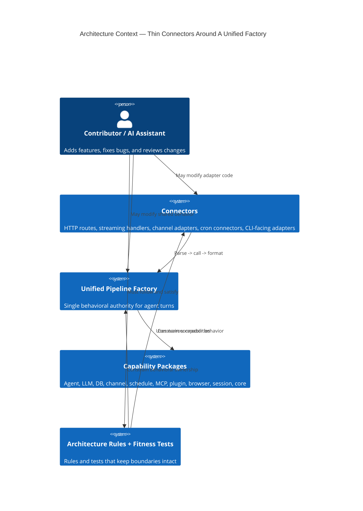

## 2. C4 Level 2: Container Diagram

This is the primary architecture diagram for the ruleset. It shows where
behavior lives and where it MUST NOT live.

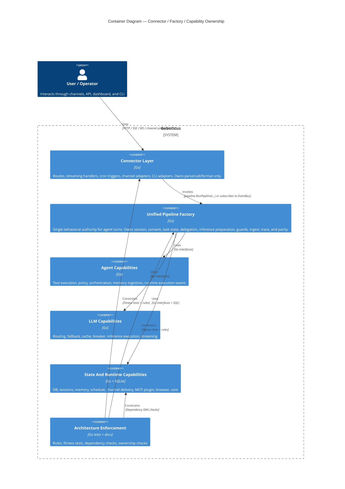

## 3. C4 Level 3: Component Diagram — Connector Layer

This is the clearest visual statement of the thin-connector rule.

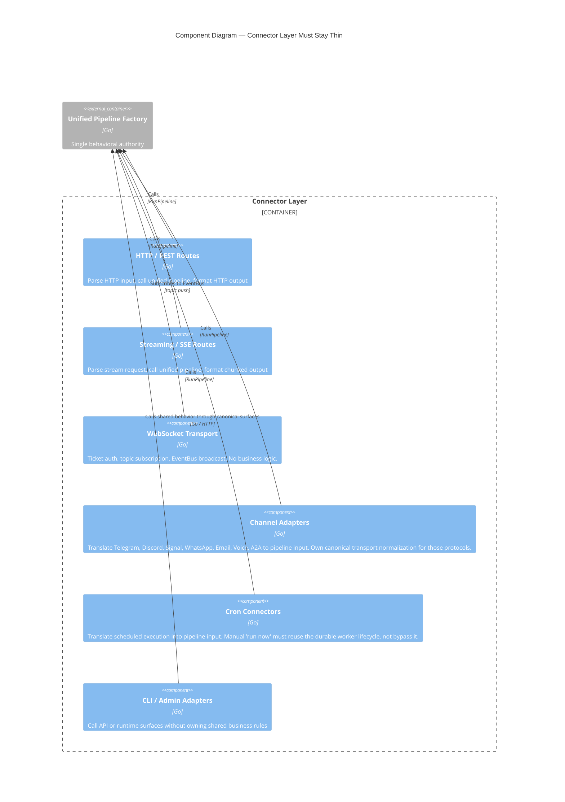

## 4. C4 Level 3: Component Diagram — Unified Pipeline Factory

This diagram shows what the architecture rules mean by "the pipeline owns
behavior."

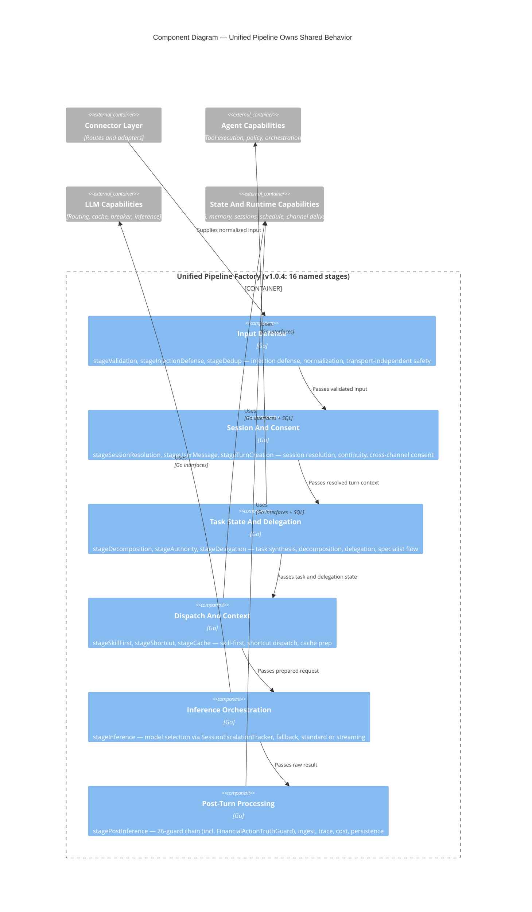

## 5. C4 Level 3: Component Diagram — Capability Narrowing

This diagram captures the intended replacement for broad service bags.

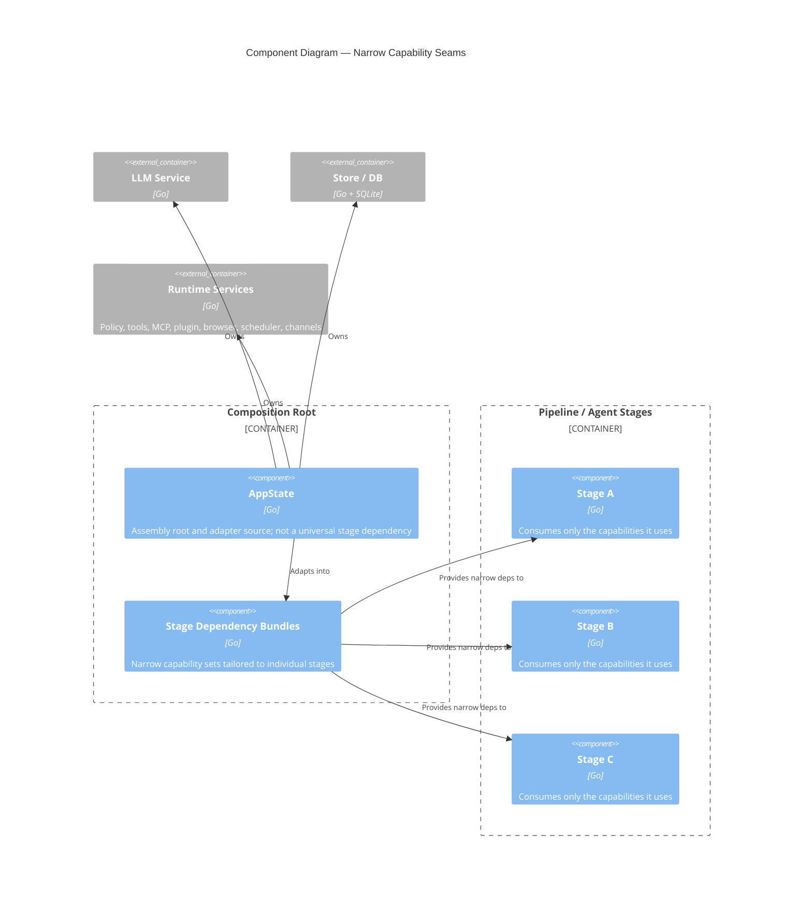

## 6. Supplementary Rule View — Security Claim And Sandbox Ownership

This view captures a runtime seam that was easy to misunderstand during parity
work: claim resolution is pipeline-owned, while sandbox enforcement is shared
across policy evaluation and tool/runtime path resolution. The important rule
is that those seams must agree on the operator-visible contract. Post-inference
guards are not allowed to invent a softer or harsher denial surface than the
actual tool/policy result; they may suppress fabricated capability claims, but
they must preserve real policy/sandbox denials as truth.

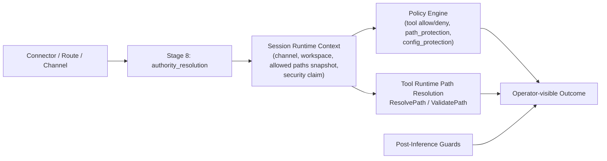

## 7. Supplementary Rule View — Release Control Plane

This view captures the release-distribution seam that `v1.0.6` exposed. The
operator-facing release is not the git tag by itself; it is the full published
control plane from tag through public site.

Two source-tree artifacts are part of that control plane before publication:

- `docs/releases/vX.Y.Z-release-notes.md`
- `CHANGELOG.md` section `## [X.Y.Z]`

If either is missing for the tagged version, the release is malformed and the
publication path must stop before claiming a live operator-facing release.

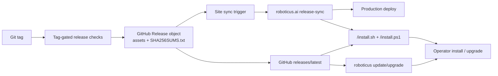

## 8. Supplementary Rule View — Streaming Is Not A Separate Product

This is a supporting diagram rather than a C4 view because it expresses a
behavioral equivalence rule.

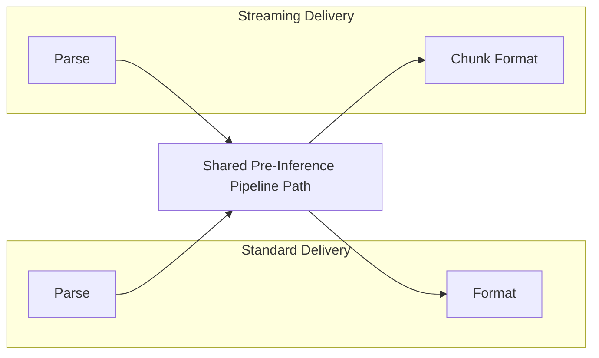

## 8. Supplementary Rule View — Channel Ingress Ownership

Webhook-capable channels follow the same thin-connector rule more strictly than
before: the route owns HTTP framing and pipeline dispatch, while the adapter
owns transport verification and payload normalization. Routes must not carry a
second copy of Telegram / WhatsApp webhook JSON parsing once the adapter
defines the canonical ingress contract.

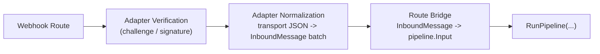

## 8.5 Supplementary Rule View — Extension Runtime Ownership

Plugin administration and plugin runtime are not the same thing. Install/search
surfaces may write plugin files or inspect catalogs, but the live runtime must
own registry construction, directory discovery, manifest parsing, init, and
install-time hot loading. Routes consume that runtime-owned registry; they do
not create their own view of plugin state. Manifest-backed plugin scripts and
skill scripts also share one core execution contract for containment,
interpreter allowlists, output limits, and sandbox env shaping.

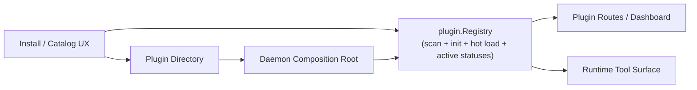

## 9. Supplementary Rule View — Request Construction Ownership

This view captures the validated v1.0.6 ownership rule for the inference
artifact. Tool selection, memory preparation, checkpoint restore, and prompt
assembly all converge into one `llm.Request`. The builder may compact or
compress older conversational history, but it must preserve the latest user
message and the higher-value system/memory surfaces.

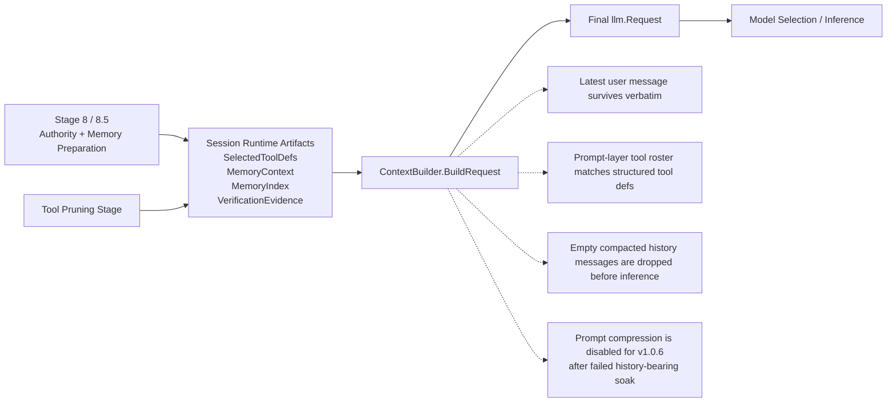

## 10. Supplementary Rule View — Continuity And Learning Ownership

This view captures the validated v1.0.6 continuity rule. Post-turn artifacts
must be written from turn-owned evidence first, then promoted through explicit
consolidation seams. Reflection is not allowed to invent durable state from
weak proxies when structured turn artifacts already exist.

## 11. Supplementary Rule View — Observability Route Ownership

This view captures the final v1.0.6 route-family contract for trace surfaces.

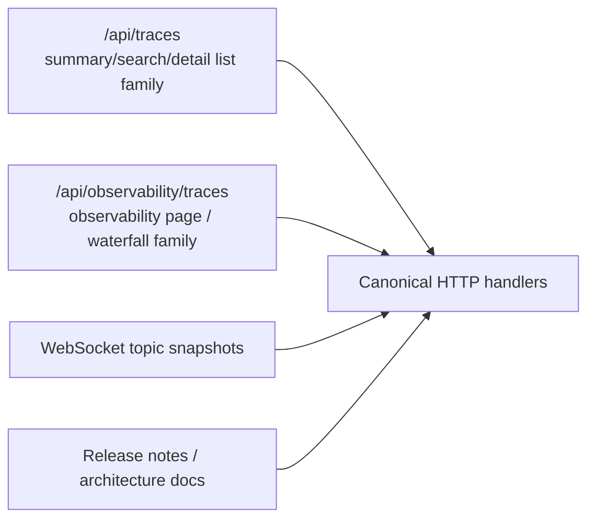

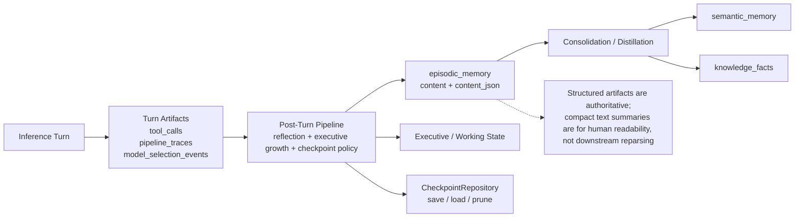

## 11. Supplementary View — WebSocket Topic Subscription (v1.0.3+)

The WebSocket layer is a push-only delivery connector. It does not call
`RunPipeline()` — it subscribes to the EventBus that the pipeline publishes to.

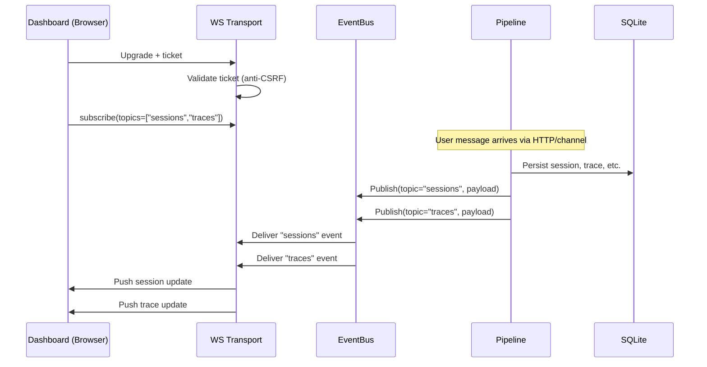

## 12. Supplementary Rule View — No Symptom Fixes

This is a supporting debugging diagram rather than a structural one.

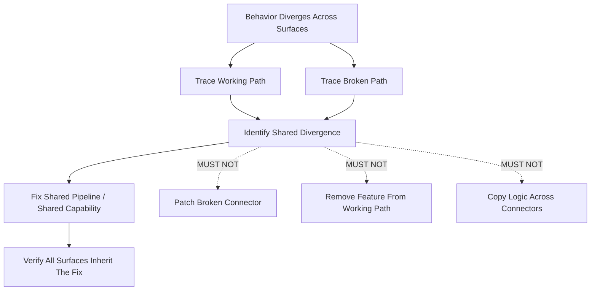

## 13. Supplementary Rule View — Enforcement Model

This diagram shows how the architecture is kept real.

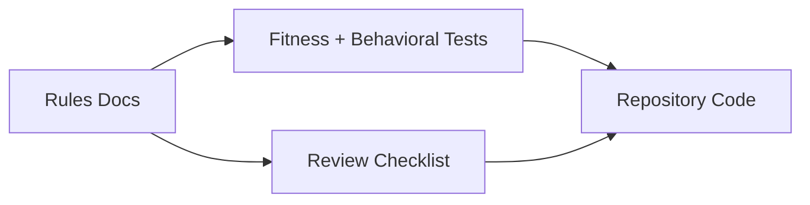

## 14. Reading Guide

- Use the C4 context and container views to understand architectural ownership.
- Use the connector-layer component diagram when reviewing route, streaming,
  cron, channel, or CLI changes.
- Use the pipeline component diagram when deciding whether behavior belongs in
  the factory.
- Use the capability diagram when evaluating stage dependencies and service-bag
  creep.
- Use the supporting diagrams when validating streaming parity, debugging
  divergence, checking request-artifact ownership, continuity/learning
  ownership, or explaining why a local connector patch is incorrect.

If a proposed code change does not fit cleanly onto these diagrams, the change
SHOULD be treated as architecturally suspect until its ownership becomes clear.

## 14. Memory Retrieval Architecture (v1.0.1+)

Two-stage pattern: direct injection for cheap/session-scoped data, index for
everything else. The model uses tools (`recall_memory`, `search_memories`) to
fetch full content on demand.

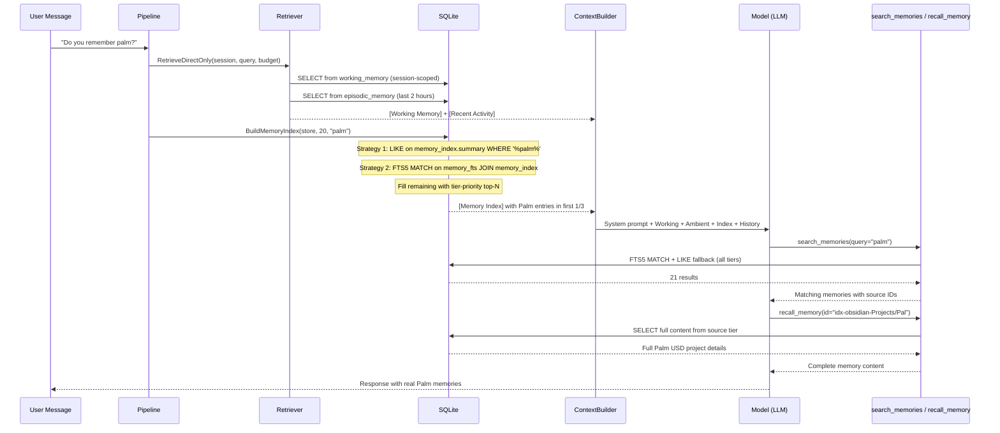

### What Gets Injected vs. What Requires Tool Calls

| Layer | Injection | Source |
|-------|-----------|--------|
| Working Memory | **Direct** (always) | `working_memory` table, session-scoped |
| Recent Activity | **Direct** (always) | `episodic_memory` last 2 hours |
| Memory Index | **Direct** (query-aware) | `memory_index` top-20 + FTS matches |
| Episodic details | **Tool** (`recall_memory`) | `episodic_memory` by ID |
| Semantic facts | **Tool** (`recall_memory`) | `semantic_memory` by ID |
| Procedural stats | **Tool** (`recall_memory`) | `procedural_memory` by ID |
| Relationship data | **Tool** (`recall_memory`) | `relationship_memory` by ID |
| Topic search | **Tool** (`search_memories`) | FTS5 + LIKE across all tiers |

---

## 15. Agentic Retrieval Architecture (v1.0.5)

```
User Query
    │
    ▼
┌────────────────────┐
│ Intent Classifier   │ ← 9 categories (centroid-based)
└────────┬───────────┘
         │
         ▼
┌────────────────────┐
│ Query Decomposer   │ ← splits compound queries into subgoals
└────────┬───────────┘
         │
         ▼
┌────────────────────┐
│ Retrieval Router   │ ← selects tiers + modes per subgoal
│ (11 routing plans) │
└────────┬───────────┘
         │
    ┌────┴────────────────┐
    │  Per-Tier Retrieval  │
    │ ┌─────┐ ┌─────┐     │
    │ │Epis.│ │Sem. │ ... │ ← BM25 + vector hybrid per tier
    │ └──┬──┘ └──┬──┘     │
    └────┼───────┼────────┘
         │       │
         ▼       ▼
┌────────────────────┐
│ Reranker / Filter  │ ← discard weak, boost authority, detect collapse
└────────┬───────────┘
         │
         ▼
┌────────────────────────────────────────┐
│ Context Assembly                       │
│ [Working State] ← direct injection     │
│ [Evidence]      ← ranked with scores   │
│ [Gaps]          ← missing tiers        │
│ [Contradictions]← conflicting entries  │
└────────┬───────────────────────────────┘
         │
         ▼
    LLM Reasoning Engine
         │
         ▼
    Post-Turn:
    ├── Reflection (episode summary → episodic_memory)
    ├── Procedure Detection (tool sequences → learned_skills)
    └── Consolidation (dreaming: promote, decay, prune)
```

### Memory Type Roles

| Memory | Question Answered | Retrieval Method | Searched? |
|--------|-------------------|-----------------|-----------|
| Semantic | "What is true?" | BM25 + vector hybrid | Yes (via router) |
| Episodic | "What happened before?" | FTS + recency union | Yes (via router) |
| Procedural | "How do I do this?" | Keyword + learned skills | Yes (via router) |
| Relationship | "Who is involved?" | Keyword lookup | Yes (via router) |
| Working | "What am I doing now?" | N/A — direct injection | **No** — active state |
