# Architecture Rules Diagrams

These diagrams are the visual companion to
[architecture_rules.md](/Users/jmachen/code/roboticus/architecture_rules.md)
and [ARCHITECTURE.md](/Users/jmachen/code/roboticus/ARCHITECTURE.md).

They are intentionally optimized for:

- thin-connector comprehension
- centralized pipeline ownership
- inward dependency direction
- narrow capability seams
- visual legibility over exhaustiveness

The preferred notation in this file is C4. Supporting diagrams are included
only where a dynamic or rule-oriented view is clearer than a structural one.

## C4 Conventions

This file follows the same C4 conventions used elsewhere in the repo:

- one architectural level per diagram
- explicit relationship labels
- transport adapters shown as adapters, not as owners of behavior
- transport payload normalization owned once per transport, not duplicated
  across route and adapter layers
- extension discovery/init owned once at daemon composition, not split between
  admin install UX and route handlers
- pipeline shown as the central factory
- supporting non-C4 diagrams clearly labeled as such
- parity preserves what is best: if a heuristic fallback exists only because an
  indexed corpus is incomplete, fix the corpus and retire the heuristic rather
  than downgrading the live path to mimic an older baseline
- benchmark validity and RCA require host resource snapshots on the same
  canonical seams that own benchmark persistence and turn diagnostics
- operator RCA views must remain legible and honest when canonical diagnostics
  are missing: macro/detail controls stay visible, diagnostics bind by turn id,
  and the UI falls back explicitly to trace-only narrative instead of quietly
  reverting to an unlabeled stage dump
- pipeline traces and canonical diagnostics must share the same authoritative
  turn id on live turns; the UI is not allowed to reconstruct that join by
  session/time proximity
- simple direct tasks are not allowed to widen into heavy autonomous turns by
  intent label alone; when synthesis says `simple` + `execute_directly`, the
  first-pass envelope must stay focused with bounded tools and only
  evidence-driven retrieval
- workspace-local vault authoring must exist as an explicit runtime capability
  when Obsidian is configured; a prompt hint or indirect skill reference is
  not an acceptable substitute for a real tool surface
- capability truth must converge before inference; DB skill inventory, runtime
  skill loading, tool registration, prompt guidance, and UI are not allowed to
  disagree about whether a capability is actually live
- cross-turn guards must preserve temporal atomicity; `PreviousAssistant` and
  prior assistant history must exclude assistant content already emitted in the
  current turn, or a successful tool-backed completion can be misclassified as
  self-repetition and force a pointless retry
- lexical noise such as `test` inside a filename or note title is not allowed
  to upcast a simple authoring turn into a coding envelope
- placeholder assistant scaffolding such as `[assistant message]` or
  `[agent message]` must be dropped at the loop boundary so it cannot enter
  history, retries, RCA, or operator-visible output
- operator RCA on desktop is expected to read left-to-right as one bounded
  decision flow: macro mode uses compact blocks plus one dense top status
  banner, while turn conclusion and health may move to a separate bottom
  banner when the header would otherwise become crowded. Verbose text belongs
  in a true floating tooltip layer or explicit detail mode. Macro nodes should
  expose only one concise signal each, with duration as the default visible
  value and routing as the deliberate exception where the selected model is
  the more useful signal. The surface must size against the real usable
  main-pane width rather than raw viewport width so persistent chrome like the
  sidebar is accounted for. If it still outgrows that space, it must expose an
  intentional horizontal scroll container inside that pane rather than
  overflowing invisibly. Detail mode must remain chronological rather than
  grouped-by-type so RCA preserves causal order; category labels may annotate
  the timeline, but they must not force operators to reconstruct event
  sequence manually. Repeat execution must be visible on the flow itself:
  any section that executes more than once carries a repeat marker, and detail
  mode preserves per-attempt sequence plus the causal bridge between success,
  guard or verifier intervention, retry, same-route reuse or fallback, and
  final outcome. The conclusion banner must be a real interpretation of those
  facts, not a statement that telemetry was collected. The UI is not allowed to
  make operators reconstruct those facts from logs or database rows, and stale
  trace-only fallback overlays must be torn down when the active session or
  expanded turn changes. Flow blocks should also carry immediate severity
  coloring from the same RCA evidence: green for clean, yellow for concern, red
  for broken. The dense top banner uses that same severity language and its
  thresholds are not ad hoc: degraded status is concern/yellow, latency above
  one second is concern/yellow, latency above one minute is broken/red, and
  `high` or `critical` pressure is broken/red. Its `Health` value is the
  aggregate of the category outcomes shown in the flow, not a separate
  invisible calculation. Every chip in that banner must also provide a
  hover/focus explanation of what the value means so operators are not forced
  to understand internal shorthand like `degraded` or `swap 78.8%` by tribal
  knowledge.
- onboarding/personality interview behavior must be defined once and reused:
  prompt, opening copy, and fallback path must all preserve the same contract
  of archetype priming before the interview, agent name as the first explicit
  question, and repeated differently-phrased probes to resolve ambiguous
  behavior preferences; referenced identities may seed provisional trait
  assumptions, but those assumptions must be made explicit and confirmed

## 1. C4 Level 1: Architecture Context

This diagram explains the architecture in terms of ownership, not deployment.

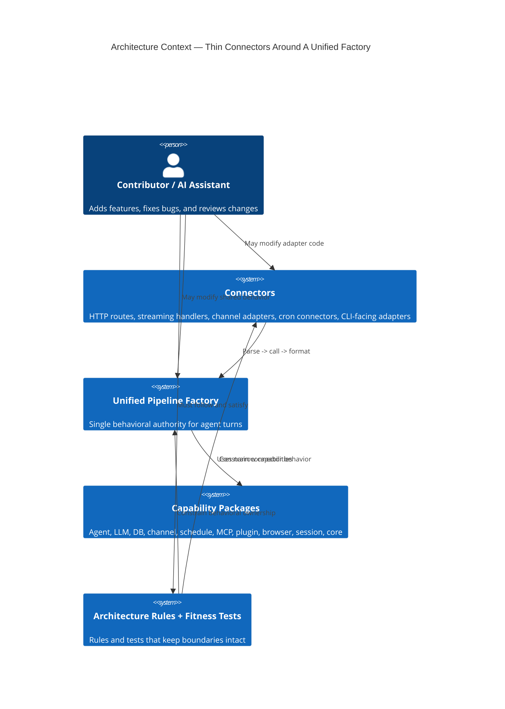

## 2. C4 Level 2: Container Diagram

This is the primary architecture diagram for the ruleset. It shows where
behavior lives and where it MUST NOT live.

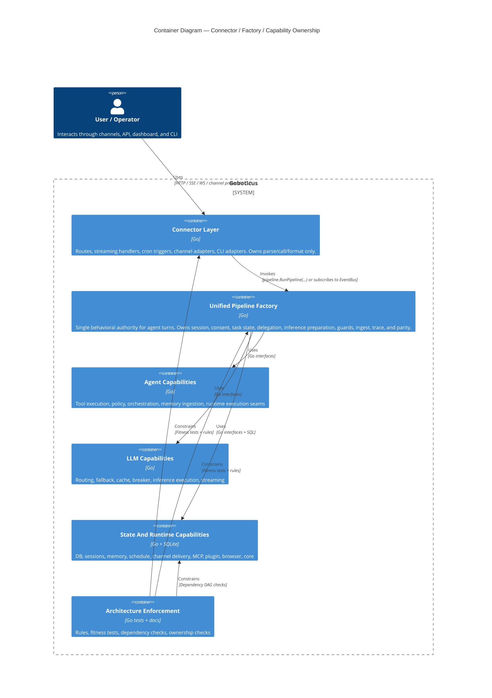

## 3. C4 Level 3: Component Diagram — Connector Layer

This is the clearest visual statement of the thin-connector rule.

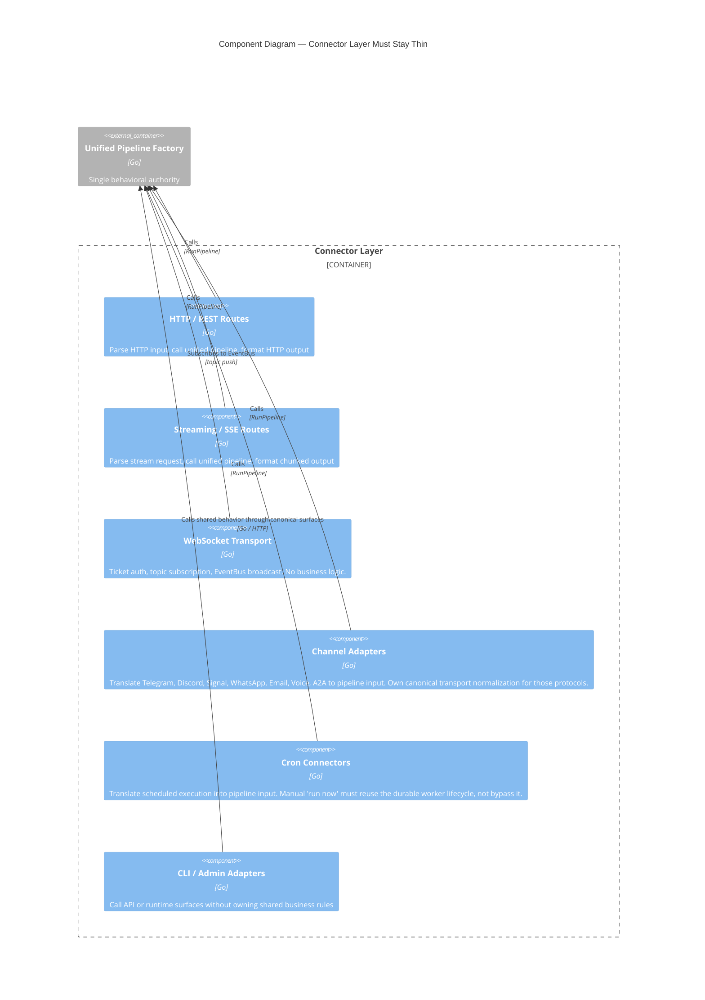

## 4. C4 Level 3: Component Diagram — Unified Pipeline Factory

This diagram shows what the architecture rules mean by "the pipeline owns
behavior."

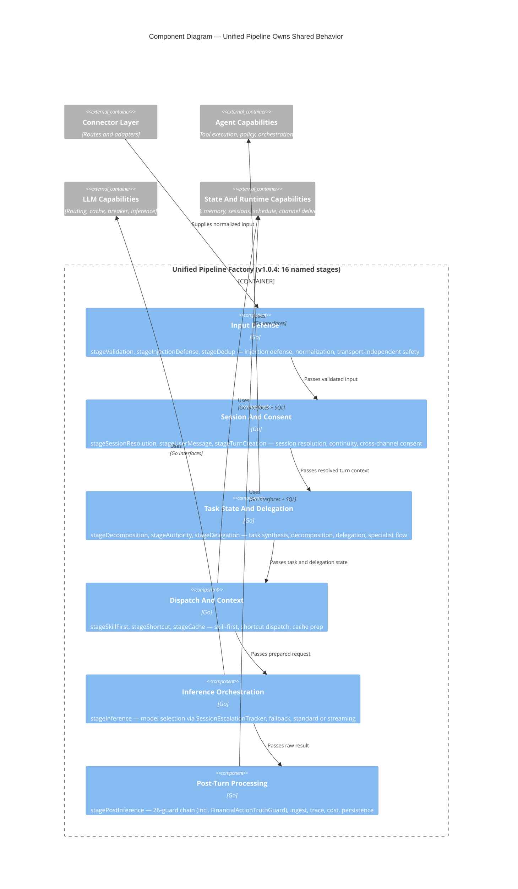

## 5. C4 Level 3: Component Diagram — Capability Narrowing

This diagram captures the intended replacement for broad service bags.

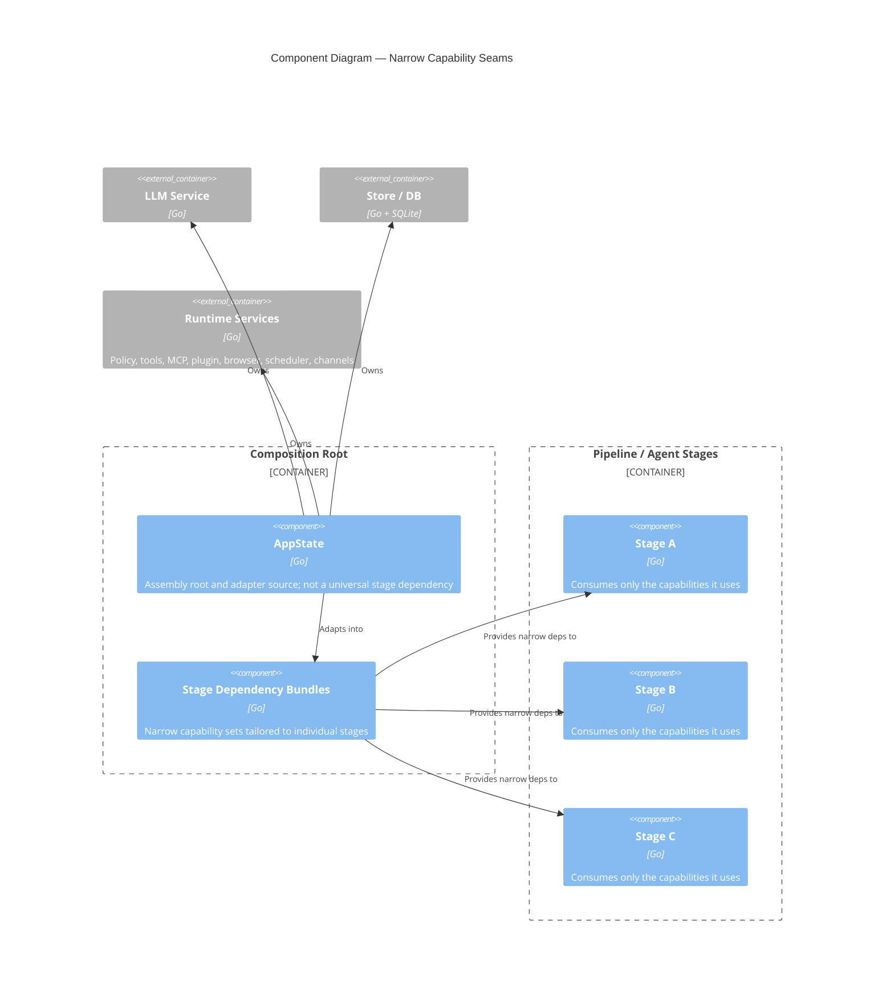

## 6. Supplementary Rule View — Operational Inventory Tools

Delegation-critical inventory such as subagent roster and skill availability
must be available on the live runtime tool surface. They are not allowed to
exist only as admin routes, dashboard summaries, or prompt-side snapshots.

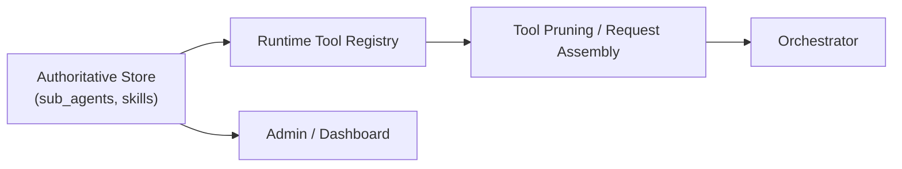

## 6.5 Supplementary Rule View — Capability Truth Ownership

Capability truth must be singular. The system is not allowed to show an
enabled skill in the UI, miss it in capability fit, omit it from the live
runtime matcher, and still tell the model it might exist. One authoritative
inventory must drive every downstream seam, and any config-gated capability
must degrade visibly and consistently when its runtime precondition is absent.

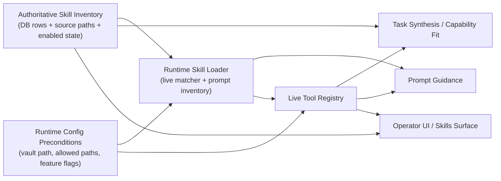

## 7. Supplementary Rule View — Delegation And Orchestration Ownership

Delegation is not allowed to devolve into a prompt-only trick. The orchestrator
may ask the runtime to orchestrate subagents, but the orchestration contract
must write the same durable lifecycle artifacts the runtime already exposes for
task inspection and retry. Subagent work still returns upward to the
orchestrator; the orchestration surface never reports directly to the operator.

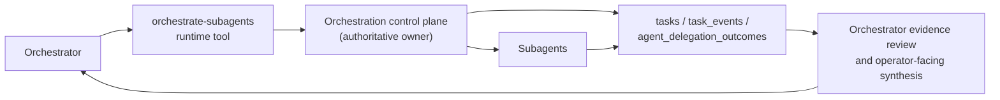

## 8. Supplementary Rule View — Security Claim And Sandbox Ownership

This view captures a runtime seam that was easy to misunderstand during parity
work: claim resolution is pipeline-owned, while sandbox enforcement is shared
across policy evaluation and tool/runtime path resolution. The important rule
is that those seams must agree on the operator-visible contract. Post-inference
guards are not allowed to invent a softer or harsher denial surface than the
actual tool/policy result; they may suppress fabricated capability claims, but
they must preserve real policy/sandbox denials as truth.

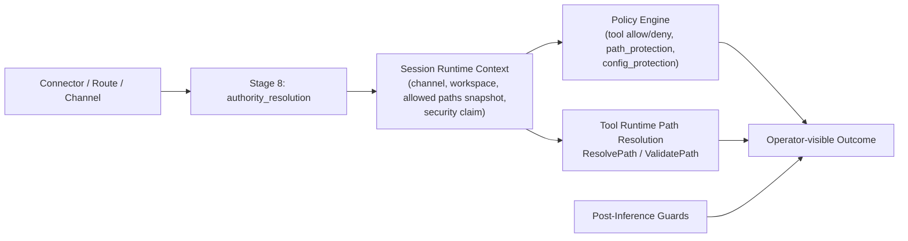

## 9. Supplementary Rule View — Host Resource Snapshot Ownership

Host resource state is not allowed to live as an ad hoc side metric or a
manual operator guess. Benchmark validity and turn RCA both depend on one
shared resource-sampling seam that feeds durable benchmark artifacts and the
canonical turn diagnostics artifact.

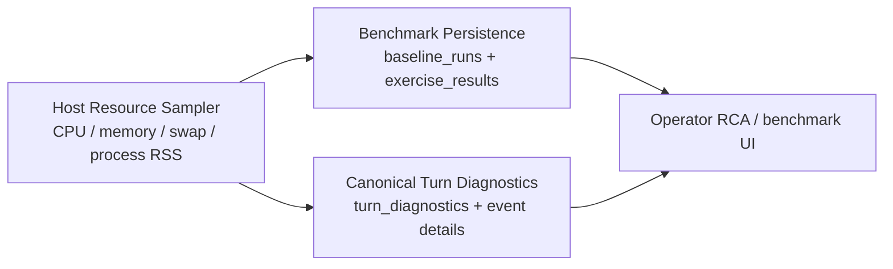

## 9. Supplementary Rule View — MCP SSE Validation Ownership

This view captures the rule behind `PAR-008`: SSE readiness claims must come
from one central validation harness and evidence artifact, not from scattered
fixture tests, checklist prose, or connector folklore. The same rule requires
one shared config-to-runtime conversion seam so auth/header semantics cannot
drift between daemon startup, route tests, and validation tooling.

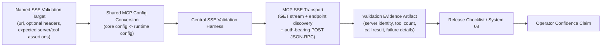

## 10. Supplementary Rule View — Streaming Is Not A Separate Product

This is a supporting diagram rather than a C4 view because it expresses a
behavioral equivalence rule.

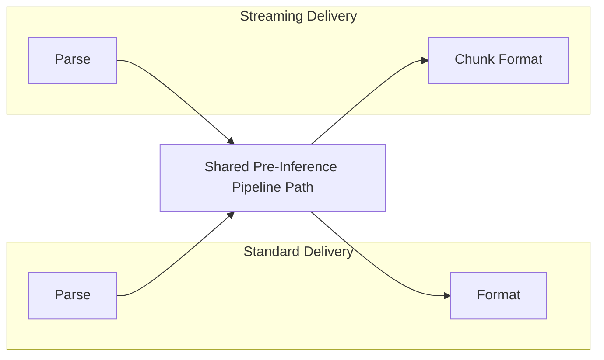

## 11. Supplementary Rule View — Channel Ingress Ownership

Webhook-capable channels follow the same thin-connector rule more strictly than
before: the route owns HTTP framing and pipeline dispatch, while the adapter
owns transport verification and payload normalization. Routes must not carry a
second copy of Telegram / WhatsApp webhook JSON parsing once the adapter
defines the canonical ingress contract.

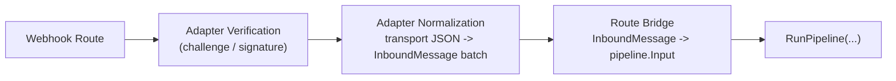

## 11.5 Supplementary Rule View — Extension Runtime Ownership

Plugin administration and plugin runtime are not the same thing. Install/search
surfaces may write plugin files or inspect catalogs, but the live runtime must
own registry construction, directory discovery, manifest parsing, init, and
install-time hot loading. Routes consume that runtime-owned registry; they do
not create their own view of plugin state. Manifest-backed plugin scripts and
skill scripts also share one core execution contract for containment,
interpreter allowlists, output limits, and sandbox env shaping.

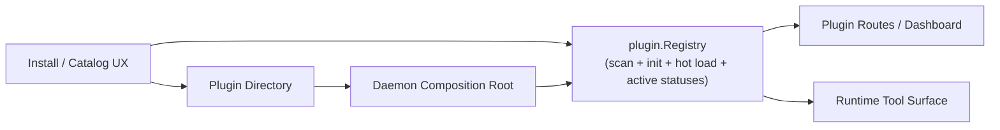

## 11. Supplementary Rule View — Request Construction Ownership

This view captures the validated v1.0.6 ownership rule for the inference
artifact. Tool selection, memory preparation, checkpoint restore, and prompt
assembly all converge into one `llm.Request`. The builder may compact or
compress older conversational history, but it must preserve the latest user
message and the higher-value system/memory surfaces.


## 10. Supplementary Rule View — Continuity And Learning Ownership

This view captures the validated v1.0.6 continuity rule. Post-turn artifacts
must be written from turn-owned evidence first, then promoted through explicit
consolidation seams. Reflection is not allowed to invent durable state from
weak proxies when structured turn artifacts already exist.

## 11. Supplementary Rule View — Model Policy And Routing Ownership

This view captures the v1.0.7 routing rule: policy filters come before ranking.
Model lifecycle state and role eligibility are architecture controls, not
tuning hints. Policy is resolved centrally from configured defaults plus
persisted operator overrides before any live or benchmark path can proceed.

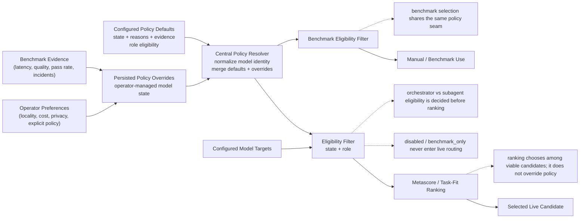

## 12. Supplementary Rule View — Orchestrator / Subagent Control Hierarchy

This view captures the v1.0.7 control-flow rule: operators never talk directly
to subagents, and subagents never report directly to operators.

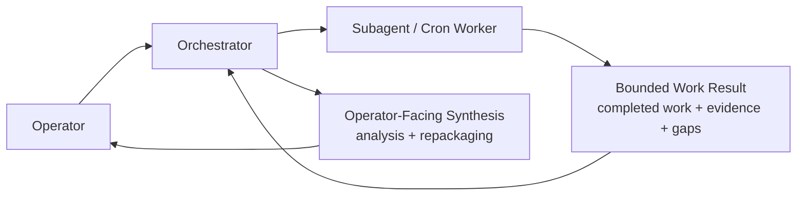

## 13. Supplementary Rule View — Delegated Task Lifecycle Ownership

This view captures the v1.0.7 rule for delegated work: task lifecycle state is
owned by one runtime repository and surfaced through orchestrator-facing tools,
not reconstructed from connector routes or subagent status sidecars.

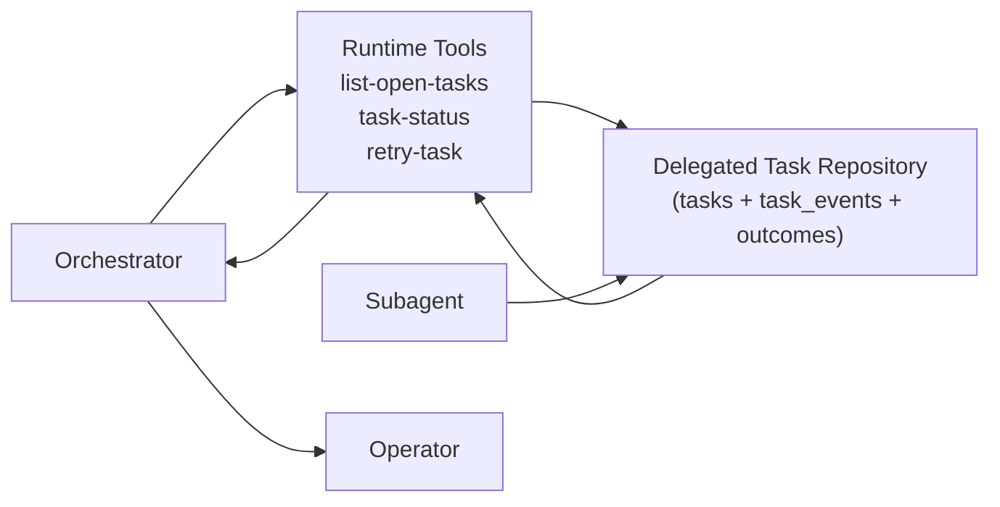

## 14. Supplementary Rule View — Subagent Composition Ownership

This view captures the v1.0.7 rule for worker creation: subagent composition is
owned by one runtime repository and may be invoked only by the orchestrator.

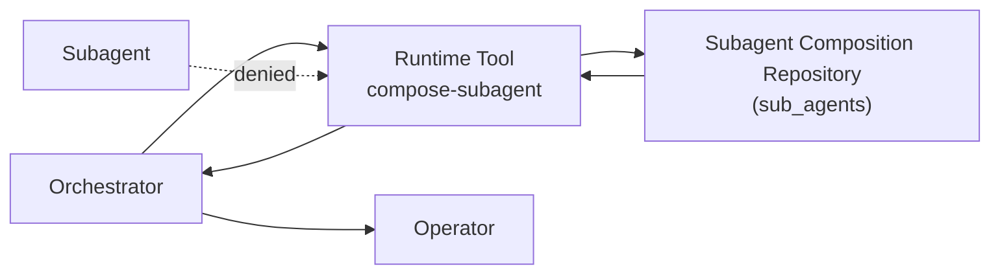

## 15. Supplementary Rule View — Skill Composition Ownership

This view captures the v1.0.7 rule for skill creation and update: skill
composition is owned by one runtime repository that writes both the durable
skill artifact and the authoritative `skills` row, and only the orchestrator
may invoke it directly.

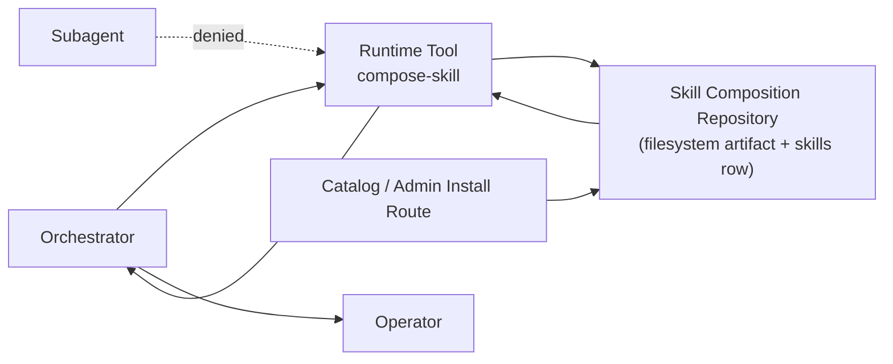

## 13. Supplementary Rule View — Observability Route Ownership

This view captures the final v1.0.6 route-family contract for trace surfaces.

```mermaid
flowchart LR
    summary["/api/traces\nsummary/search/detail list family"]
    observability["/api/observability/traces\nobservability page / waterfall family"]
    ws["WebSocket topic snapshots"]
    handlers["Canonical HTTP handlers"]
    release["Release notes / architecture docs"]

    summary --> handlers
    observability --> handlers
    ws --> handlers
    release --> handlers
```

## 14. Supplementary Rule View — Operator RCA Flow Ownership

The operator-facing flow view is not allowed to degrade into a thin wrapper
around raw trace rows. The canonical `turn_diagnostics` artifact is the
authoritative RCA surface, and the UI must present it as a decision narrative:

- macro by default
- detailed only on explicit operator demand
- grouped by decision seam instead of raw event order
- desktop-first left-to-right comprehension rather than a disguised vertical log
- persisted summary narratives must already be interpretive conclusions derived
  from the turn facts, not placeholders that merely say diagnostics exist

```mermaid
flowchart LR
    diag["Canonical turn_diagnostics\nsummary + events + recommendations"]
    flow["/api/traces/{turn}/flow\nstage timing / structural flow"]
    ui["Operator Flow View\nmacro RCA narrative + detailed drilldown"]
    macro["Macro View\nTask · Envelope · Routing · Execution · Recovery · Outcome"]
    detail["Detailed View\ncategorized event stream + raw evidence"]
    operator["Operator"]

    diag --> ui
    flow --> ui
    ui --> macro
    ui --> detail
    macro --> operator
    detail --> operator
```

## 15. Supplementary Rule View — Verifier Evidence Ownership

This view captures the active v1.0.7 verifier-depth rule: contradiction and
proof evaluation must consume the same typed evidence artifact produced by
retrieval/context assembly. The verifier is not allowed to reconstruct that
state later from lossy rendered text or a boolean-only contradiction flag.

```mermaid
flowchart LR
    retrieval["Stage 8.5 Retrieval / Context Assembly"]
    typed["Typed Verification Evidence\nEvidenceItems\nContradictions\nExecutive State"]
    session["Session Artifact Boundary"]
    verifier["Verifier / Claim Audits"]
    issues["Verification Issues\nmissing proof / contradiction handling"]
    trace["Turn Diagnostics / Trace"]

    retrieval --> typed --> session --> verifier
    verifier --> issues
    verifier --> trace

    note1["Contradictions are structured artifacts,\nnot only a boolean summary"]
    note2["Proof obligations are evaluated per claim"]
    note3["RCA and future ML use the same verifier artifact"]

    typed -.-> note1
    verifier -.-> note2
    trace -.-> note3
```

## 16. Supplementary Rule View — Retrieval Fusion Ownership

Fusion is now an explicit retrieval-stage concern, not a side effect spread
across router weights and reranker adjustments. The rule is:

- tier retrieval produces raw candidates with provenance
- fusion combines route weight, provenance, freshness, authority, and
  corroboration into the first unified retrieval-quality score
- optional LLM reranking may run after fusion as a bounded semantic scorer
- deterministic reranking still owns the final narrowing / collapse protection
  and remains the fallback path when LLM reranking does not run cleanly

```mermaid
flowchart LR
    decompose["Query Decomposition"]
    route["Retrieval Router"]
    tiers["Tier Retrieval\nsemantic / episodic / procedural / relationship"]
    fusion["Fusion Stage\nroute weight + provenance + freshness + authority + corroboration"]
    llmrerank["Optional LLM Rerank\nbounded semantic scoring"]
    rerank["Deterministic Reranker\nthresholding / narrowing / collapse protection"]
    assemble["Context Assembly"]
    trace["RCA / ML Surfaces"]

    decompose --> route --> tiers --> fusion --> llmrerank --> rerank --> assemble
    fusion --> trace
    llmrerank --> trace
    rerank --> trace
```

```mermaid
flowchart LR
    inference["Inference Turn"]
    traces["Turn Artifacts\ntool_calls\npipeline_traces\nmodel_selection_events"]
    post["Post-Turn Pipeline\nreflection + executive growth + checkpoint policy"]
    episodic["episodic_memory\ncontent + content_json"]
    executive["Executive / Working State"]
    checkpoint["CheckpointRepository\nsave / load / prune"]
    consolidate["Consolidation / Distillation"]
    semantic["semantic_memory"]
    facts["knowledge_facts"]

    inference --> traces --> post
    post --> episodic
    post --> executive
    post --> checkpoint
    episodic --> consolidate
    consolidate --> semantic
    consolidate --> facts

    note["Structured artifacts are authoritative;\ncompact text summaries are for human readability, not downstream reparsing"]
    episodic -.-> note
```

## 11. Supplementary View — WebSocket Topic Subscription (v1.0.3+)

The WebSocket layer is a push-only delivery connector. It does not call
`RunPipeline()` — it subscribes to the EventBus that the pipeline publishes to.

```mermaid
sequenceDiagram
    participant D as Dashboard (Browser)
    participant WS as WS Transport
    participant EB as EventBus
    participant P as Pipeline
    participant DB as SQLite

    D->>WS: Upgrade + ticket
    WS->>WS: Validate ticket (anti-CSRF)
    D->>WS: subscribe(topics=["sessions","traces"])

    Note over P: User message arrives via HTTP/channel
    P->>DB: Persist session, trace, etc.
    P->>EB: Publish(topic="sessions", payload)
    P->>EB: Publish(topic="traces", payload)

    EB->>WS: Deliver "sessions" event
    EB->>WS: Deliver "traces" event
    WS->>D: Push session update
    WS->>D: Push trace update
```

## 12. Supplementary Rule View — No Symptom Fixes

This is a supporting debugging diagram rather than a structural one.

```mermaid
flowchart TD
    bug["Behavior Diverges Across Surfaces"]
    working["Trace Working Path"]
    broken["Trace Broken Path"]
    diff["Identify Shared Divergence"]
    shared["Fix Shared Pipeline / Shared Capability"]
    verify["Verify All Surfaces Inherit The Fix"]

    wrong1["Patch Broken Connector"]
    wrong2["Remove Feature From Working Path"]
    wrong3["Copy Logic Across Connectors"]

    bug --> working
    bug --> broken
    working --> diff
    broken --> diff
    diff --> shared --> verify

    diff -. "MUST NOT" .-> wrong1
    diff -. "MUST NOT" .-> wrong2
    diff -. "MUST NOT" .-> wrong3
```

## 13. Supplementary Rule View — Enforcement Model

This diagram shows how the architecture is kept real.

```mermaid
flowchart LR
    rules["Rules Docs"]
    tests["Fitness + Behavioral Tests"]
    review["Review Checklist"]
    code["Repository Code"]

    rules --> tests
    rules --> review
    tests --> code
    review --> code
```

## 14. Reading Guide

- Use the C4 context and container views to understand architectural ownership.
- Use the connector-layer component diagram when reviewing route, streaming,
  cron, channel, or CLI changes.
- Use the pipeline component diagram when deciding whether behavior belongs in
  the factory.
- Exercise/baseline prompt selection belongs to the shared exercise factory:
  connectors may choose models, iterations, and an optional canonical intent
  filter, but they must not define ad hoc prompt subsets or capability slices
  outside the matrix owned by `internal/llm`.
- Use the capability diagram when evaluating stage dependencies and service-bag
  creep.
- Use the supporting diagrams when validating streaming parity, debugging
  divergence, checking request-artifact ownership, continuity/learning
  ownership, or explaining why a local connector patch is incorrect.

If a proposed code change does not fit cleanly onto these diagrams, the change
SHOULD be treated as architecturally suspect until its ownership becomes clear.

## 14. Memory Retrieval Architecture (v1.0.1+)

Two-stage pattern: direct injection for cheap/session-scoped data, index for
everything else. The model uses tools (`recall_memory`, `search_memories`) to
fetch full content on demand.

```mermaid
sequenceDiagram
    participant U as User Message
    participant P as Pipeline
    participant R as Retriever
    participant DB as SQLite
    participant CB as ContextBuilder
    participant M as Model (LLM)
    participant T as search_memories / recall_memory

    U->>P: "Do you remember palm?"
    P->>R: RetrieveDirectOnly(session, query, budget)
    R->>DB: SELECT from working_memory (session-scoped)
    R->>DB: SELECT from episodic_memory (last 2 hours)
    R-->>CB: [Working Memory] + [Recent Activity]

    P->>DB: BuildMemoryIndex(store, 20, "palm")
    Note over DB: Strategy 1: LIKE on memory_index.summary WHERE '%palm%'
    Note over DB: Strategy 2: FTS5 MATCH on memory_fts JOIN memory_index
    Note over DB: Fill remaining with tier-priority top-N
    DB-->>CB: [Memory Index] with Palm entries in first 1/3

    CB->>M: System prompt + Working + Ambient + Index + History
    M->>T: search_memories(query="palm")
    T->>DB: FTS5 MATCH + LIKE fallback (all tiers)
    DB-->>T: 21 results
    T-->>M: Matching memories with source IDs
    M->>T: recall_memory(id="idx-obsidian-Projects/Pal")
    T->>DB: SELECT full content from source tier
    DB-->>T: Full Palm USD project details
    T-->>M: Complete memory content
    M-->>U: Response with real Palm memories
```

### What Gets Injected vs. What Requires Tool Calls

| Layer | Injection | Source |
|-------|-----------|--------|
| Working Memory | **Direct** (always) | `working_memory` table, session-scoped |
| Recent Activity | **Direct** (always) | `episodic_memory` last 2 hours |
| Memory Index | **Direct** (query-aware) | `memory_index` top-20 + FTS matches |
| Episodic details | **Tool** (`recall_memory`) | `episodic_memory` by ID |
| Semantic facts | **Tool** (`recall_memory`) | `semantic_memory` by ID |
| Procedural stats | **Tool** (`recall_memory`) | `procedural_memory` by ID |
| Relationship data | **Tool** (`recall_memory`) | `relationship_memory` by ID |
| Topic search | **Tool** (`search_memories`) | FTS5 + LIKE across all tiers |

---

## 15. Agentic Retrieval Architecture (v1.0.5)

```
User Query
    │
    ▼
┌────────────────────┐
│ Intent Classifier   │ ← 9 categories (centroid-based)
└────────┬───────────┘
         │
         ▼
┌────────────────────┐
│ Query Decomposer   │ ← splits compound queries into subgoals
└────────┬───────────┘
         │
         ▼
┌────────────────────┐
│ Retrieval Router   │ ← selects tiers + modes per subgoal
│ (11 routing plans) │
└────────┬───────────┘
         │
    ┌────┴────────────────┐
    │  Per-Tier Retrieval  │
    │ ┌─────┐ ┌─────┐     │
    │ │Epis.│ │Sem. │ ... │ ← BM25 + vector hybrid per tier
    │ └──┬──┘ └──┬──┘     │
    └────┼───────┼────────┘
         │       │
         ▼       ▼
┌────────────────────┐
│ Reranker / Filter  │ ← discard weak, boost authority, detect collapse
└────────┬───────────┘
         │
         ▼
┌────────────────────────────────────────┐
│ Context Assembly                       │
│ [Working State] ← direct injection     │
│ [Evidence]      ← ranked with scores   │
│ [Gaps]          ← missing tiers        │
│ [Contradictions]← conflicting entries  │
└────────┬───────────────────────────────┘
         │
         ▼
    LLM Reasoning Engine
         │
         ▼
    Post-Turn:
    ├── Reflection (episode summary → episodic_memory)
    ├── Procedure Detection (tool sequences → learned_skills)
    └── Consolidation (dreaming: promote, decay, prune)
```

### Memory Type Roles

| Memory | Question Answered | Retrieval Method | Searched? |
|--------|-------------------|-----------------|-----------|
| Semantic | "What is true?" | BM25 + vector hybrid | Yes (via router) |
| Episodic | "What happened before?" | FTS + recency union | Yes (via router) |
| Procedural | "How do I do this?" | Keyword + learned skills | Yes (via router) |
| Relationship | "Who is involved?" | Keyword lookup | Yes (via router) |
| Working | "What am I doing now?" | N/A — direct injection | **No** — active state |
