# Architecture Rules Diagrams

These diagrams are the visual companion to
[architecture_rules.md](/Users/jmachen/code/roboticus/architecture_rules.md)
and [ARCHITECTURE.md](/Users/jmachen/code/roboticus/ARCHITECTURE.md).

They are intentionally optimized for:

- thin-connector comprehension
- centralized pipeline ownership
- inward dependency direction
- narrow capability seams
- visual legibility over exhaustiveness

The preferred notation in this file is C4. Supporting diagrams are included
only where a dynamic or rule-oriented view is clearer than a structural one.

## C4 Conventions

This file follows the same C4 conventions used elsewhere in the repo:

- one architectural level per diagram
- explicit relationship labels
- transport adapters shown as adapters, not as owners of behavior
- transport payload normalization owned once per transport, not duplicated
  across route and adapter layers
- extension discovery/init owned once at daemon composition, not split between
  admin install UX and route handlers
- pipeline shown as the central factory
- supporting non-C4 diagrams clearly labeled as such
- parity preserves what is best: if a heuristic fallback exists only because an
  indexed corpus is incomplete, fix the corpus and retire the heuristic rather
  than downgrading the live path to mimic an older baseline
- shared low-level primitives such as hashing and ID/content normalization live
  at or below `internal/core`; `internal/db` is not allowed to depend upward on
  `internal/agent/*` for generic helpers
- release-shaped binaries get version truth from one authoritative build seam:
  CLI version is stamped into `cmd/internal/cmdutil.Version`, daemon banner
  version into `internal/daemon.version`, and CI/release/local helper build
  paths are not allowed to drift from that contract
- release publication and downstream release notifications must derive from one
  explicit tag authority under both tag-push and manual rerun paths; critical
  release control flow is not allowed to depend on opaque third-party action
  context for tag identity, prerelease state, dispatch payload semantics, or
  success/failure reporting
- release-critical cross-repository site sync uses the shared
  `SITE_DISPATCH_PAT` secret contract; optional release notifications must
  skip cleanly when SMTP or Discord secrets are absent and must not turn a
  complete artifact publication into a false release failure
- CI/release security-tool installation must be pinned and replayable; active
  workflows are not allowed to float `@latest` for critical scanners whose
  behavior can silently change between releases
- route handlers may share connector-local helpers, but policy/exercise/export
  admin surfaces are not allowed to collapse into one monolithic route file
- unified pipeline-path enforcement follows the whole connector surface for a
  route family, not one legacy filename after a bounded split
- verification coverage, executive-plan growth, and retry guidance must all
  consume one canonical subgoal set; the framework is not allowed to count the
  whole prompt and its conjunction-split parts as separate requested goals
- benchmark validity and RCA require host resource snapshots on the same
  canonical seams that own benchmark persistence and turn diagnostics
- benchmark validity also requires provider/model runtime-state snapshots on
  the same benchmark seams, so empty or failed exercise rows can be attributed
  to capability weakness vs missing/unloaded/unreachable model state
- benchmark scoring truth starts from the prompt contract, not generic
  verbosity or marker density; concise direct answers are not allowed to score
  poorly just because they omit irrelevant execution/delegation language
- historical benchmark rows must remain rescorable when prompt identity and raw
  response content are persisted; scoring-regime changes are not allowed to
  force blind reruns by default
- benchmark aggregate quality must keep one explicit denominator contract:
  summary and scorecard views are not allowed to silently disagree about
  whether failures counted as zeroes or were excluded from an average
- partial benchmark exercise runs update only the exercised model/intent slice;
  comparison rows must preserve untouched historical intent evidence and
  recompute aggregate quality/latency from the merged scorecard instead of
  replacing the whole model row
- model comparison rows expose evidence coverage, because one observed intent
  slice is not the same evidentiary basis as a full seven-intent benchmark
- benchmark phase timing is first-class evidence: retrieval, think, execute,
  observe, reflect, validate, retry, and total wall-clock timing must be
  reportable strongly enough to distinguish model latency from framework/tool
  latency
- benchmark scorecard latency is model-attributable: comparison tables and
  per-intent latency summaries use composite model inference time, while
  whole-turn/pipeline latency remains RCA context only
- benchmark telemetry fetch is allowed a bounded settling window after a turn
  completes; scorecards are not allowed to drop phase timing silently just
  because trace/diagnostic persistence became visible slightly after the main
  response returned
- benchmark exercise timeout policy must be prompt-aware: trivial/direct rows
  and complex multi-step `T-E-O-R` rows are not allowed to share one flat
  cloud timeout, and the benchmark client's wait budget must remain distinct
  from the server-side execution budget
- benchmark model-call timeout is a per-inference-call budget, not a whole-row
  stopwatch. If a task requires think, tool observation, and reflection calls,
  the model/provider timer resets after each completed inference while total row
  wall-clock remains separately reported
- exploratory baseline ceilings and release-gate latency SLOs are separate
  contracts: baseline timeouts classify observability limits, while release
  gates may enforce product latency thresholds
- exercise rows persist an explicit outcome class such as clean pass, slow
  pass, provider timeout, transport/API failure, empty response, or
  quality-gate failure; pass/fail alone is not RCA truth
- benchmark efficacy scorecards must distinguish evaluable model behavior from
  benchmark validity incidents: transport/API failures and provider timeouts
  remain persisted RCA evidence, but they are not allowed to count as exercised
  efficacy coverage or overwrite prior per-intent model evidence in comparison
  tables
- benchmark progress rows are operator telemetry, not artifact transport:
  untrusted model text rendered inline by the CLI must be reduced to a bounded
  single-line preview with control sequences, line breaks, tabs, and Markdown
  fence delimiters neutralized; full raw content belongs in persisted exercise
  artifacts and RCA joins, never in the live progress row
- benchmark exercise rows persist canonical `turn_id` for every new prompt
  result so RCA, trace views, and scorecards join on one authoritative turn
  identity instead of timestamp/proximity heuristics
- benchmark/RCA callers may establish `turn_id` before execution and pass it
  into the pipeline; canonical identity is a correlation input, not something
  inferred only from successful pipeline output
- after authoritative tool observation, empty reflection is not a valid final
  answer: the loop must finalize from observed evidence or return a real error
- verifier retry suppression after execution progress requires non-empty final
  content; a suppressed retry may preserve a weak task-specific answer, but it
  must not persist a blank assistant message under an `ok` turn
- CLI/API benchmark connectors treat non-2xx problem-details `detail` payloads
  as errors so failed turns cannot become blank successful dispatches
- once a benchmark/live turn has a canonical `turn_id`, trace and diagnostic
  persistence use a detached bounded persistence context rather than the raw
  client/request context; client cancellation is not allowed to erase RCA
  artifacts for an already-started turn
- coding prompts that request runnable artifacts are not allowed to be graded
  primarily by prose quality; artifact parse/typecheck/compile and bounded
  input/output correctness precede explanation/style in the active benchmark
  architecture
- source-backed code surgery is not generic heavy code work. Refactor/fix/debug
  turns over the current repository must use a repo-grounded focused profile
  that anchors on the actual source root, prioritizes authoritative source
  reads and bounded inspection over repo-inventory theater, treats productive
  read/list/glob steps as progress, and keeps retrieval neutral unless
  continuity/evidence cues are explicit
- runtime filesystem guidance must expose inherited allowed-root semantics:
  allowed paths are roots, descendants inherit access unless a narrower deny or
  read/write distinction applies, and the model must attempt the relevant tool
  before claiming that an allowed subtree needs additional configuration
- short referential execution follow-ups such as "examine it", "inspect that",
  or "look there" must preserve the immediately prior assistant context so the
  pipeline can resolve the referenced vault/folder/section instead of treating
  the turn as a disconnected generic request
- session resolution must not continue on a phantom explicit `session_id`;
  body-scoped session ids either resolve to a durable `sessions` row or fail
  cleanly as not found before message persistence begins
- operator RCA views must remain legible and honest when canonical diagnostics
  are missing: macro/detail controls stay visible, diagnostics bind by turn id,
  and the UI falls back explicitly to trace-only narrative instead of quietly
  reverting to an unlabeled stage dump
- pipeline traces and canonical diagnostics must share the same authoritative
  turn id on live turns; the UI is not allowed to reconstruct that join by
  session/time proximity
- simple direct tasks are not allowed to widen into heavy autonomous turns by
  intent label alone; when synthesis says `simple` + `execute_directly`, the
  first-pass envelope must stay focused with bounded tools and only
  evidence-driven retrieval
- tool-bearing turns route on `TOOL_USE` evidence first; if any
  request-eligible candidates have observed `TOOL_USE` evidence, under-evidenced
  candidates are ignored for live selection rather than merely narrated as
  “ignored” in RCA
- workspace-local vault authoring must exist as an explicit runtime capability
  when Obsidian is configured; a prompt hint or indirect skill reference is
  not an acceptable substitute for a real tool surface
- capability truth must converge before inference; DB skill inventory, runtime
  skill loading, tool registration, prompt guidance, and UI are not allowed to
  disagree about whether a capability is actually live
- capability denials must be evidence-backed. The pipeline is not allowed to
  tell the operator a path, web/image surface, or filesystem action is
  unavailable unless that conclusion is derived from the active tool surface,
  sandbox policy, network policy, or provider capability state and is visible
  in RCA
- allowed-path reasoning must be subtree-aware: if an allowed root has already
  admitted `/a/b`, then `/a/b/c` is readable by default unless a narrower deny
  rule, mode distinction, or policy guard says otherwise
- user correction turns must update the active task interpretation before
  response generation. Corrections such as "section, not session" are not
  license to invent unrelated server/config work
- cross-turn guards must preserve temporal atomicity; `PreviousAssistant` and
  prior assistant history must exclude assistant content already emitted in the
  current turn, or a successful tool-backed completion can be misclassified as
  self-repetition and force a pointless retry
- lexical noise such as `test` inside a filename or note title is not allowed
  to upcast a simple authoring turn into a coding envelope
- a single-step direct authoring request is not allowed to become
  `moderate`/`complex` on raw word count alone; structural step count and
  artifact count must dominate for note/document/file authoring so the focused
  execution envelope can still activate on realistic operator phrasing
- once the focused authoring envelope activates, it is not allowed to inherit
  the generic operational always-include tool set; the request must use a
  capability-scoped tool profile built around artifact-writing tools first,
  minimal runtime/workspace context second, and retrieval only when continuity
  evidence actually exists
- once a turn has already made substantive execution progress, guard and
  verifier policy are not allowed to trigger another full inference attempt
  for purely narrative-quality defects; post-success retries must be reserved
  for execution-critical failures that make the claimed work untrustworthy or
  materially incomplete
- once a side-effecting tool call has succeeded, the loop is not allowed to
  execute the same call again in the same turn unless that tool explicitly
  declares replay safety; replay protection must come from the central tool
  semantics map, not one-off loop heuristics. Replay identity must resolve a
  semantics-derived protected resource/effect fingerprint rather than relying
  on raw argument equality alone, and replay suppression must be surfaced
  unchanged through canonical diagnostics and operator RCA rather than
  inferred later from side effects that did not happen
- procedural uncertainty is not allowed to stop at “retrieve or don’t
  retrieve”; when a turn produces a novel procedural success, failure, or
  mixed outcome, distillation has to preserve that result with reusable
  outcome semantics so later applied-learning retrieval can reuse what worked
  and avoid what already failed. Those facts are not allowed to stay buried
  in trace metadata or memory rows alone: canonical RCA must record both the
  pre-inference applied-learning decision and the post-turn reuse-capture
  outcome in chronological order, and the operator-facing decision flow must
  expose that learning lane as a first-class part of the same integrated RCA
  narrative rather than leaving it buried in detail mode
- memory-persistence intake over an allowed subtree must enter a bounded
  inspect/evaluate/persist contract. The agent is not allowed to ask for a new
  allowlist entry for a descendant of an already allowed vault root, and it is
  not allowed to wholesale persist vault content without candidate selection,
  evidence, and decay/relevance policy
- promissory execution language creates a liveness obligation. If the agent
  says it will "test", "check", "verify", or equivalent, the same turn must
  produce an observable tool attempt, progress heartbeat, timeout diagnostic,
  or explicit failure instead of disappearing behind an unreported action
- once the pipeline has already injected `[Retrieved Evidence]`, `[Gaps]`, and
  a memory index for the current turn, that injected evidence is the first
  memory authority for the turn. Prompt guidance is not allowed to tell the
  model to re-search memory unconditionally “even if injected memories are
  present”; follow-up `recall_memory` / `search_memories` calls are gap-filling
  hydration steps only when the injected evidence or index is insufficient for
  the task
- the official execution architecture is `R-TEOR-R`:
  retrieval-memory `R` -> `Think -> Execute -> Observe -> Reflect` -> retention-memory `R`
- the leading `R` is retrieval memory: prior evidence, contradictions, and
  confidence modifiers that matter before the turn acts
- `TEOR` is the live execution core
- the trailing `R` is retention memory: reinforcement, decay, and learning
  hygiene after reflection has decided what the turn actually proved
- post-observation reasoning is the `R` in `TEOR`, not another generic
  execution-think pass. After successful tool-backed observation, the default
  posture is preserve-and-interpret: interpret observed results, validate task
  sufficiency, refine operator presentation, and only escalate back into
  execution when the reflect phase explicitly identifies a remaining execution
  gap. Provider/protocol-specific structured-output requirements are not
  allowed to destroy an already-successful execution path during reflection
- the reflective `R` must consume a canonical `TOTOF` artifact, not a universal
  raw transcript:
  - `T`: user task
  - `O`: authoritative observed results
  - `T`: key tool outcomes
  - `O`: unresolved gaps or contradictions
  - `F`: bounded instruction to interpret and finalize
- provider/model-specific reflection adapters may render `TOTOF` differently,
  but the canonical reflective state must remain stable across providers and
  thinking-mode combinations
- reflective `R` may continue execution only through an explicit continuation
  decision. That signal may be textual (`CONTINUE_EXECUTION ...`) or
  structural (tool calls returned from the reflect request instead of a final
  answer). Neither form is allowed to be flattened into final operator prose
- reflection continuation is not allowed to fall back to ordinary session
  replay. The framework must derive a canonical continuation artifact from the
  current `TOTOF` state plus the explicit remaining-work reason and render
  that provider-safely for the active model/runtime, rather than appending a
  prose system note and reopening generic `think` semantics over raw assistant
  and tool-call history
- once reflective `R` has finalized a turn after successful `E/O`, later
  validation is not allowed to reopen ordinary inference with raw session
  replay. Post-reflection correction must either preserve the reflected answer
  and record remaining concerns, or use a reflection-scoped correction path
  that consumes canonical reflection state instead of replaying assistant
  tool-call transcript history
- bounded multi-artifact note/document/file authoring is still focused
  authoring. A small explicit set of artifact writes with exact content and
  linking is not allowed to become `complex` specialist work just because it is
  no longer a literal single-file turn; task synthesis and envelope policy must
  preserve direct execution plus artifact-proof requirements for that class
- source-backed focused authoring must preserve authoritative source-read
  capability on the same central semantics map as artifact writes. A
  prompt-named input artifact such as `requirements.txt` is not allowed to
  degrade into “unknown tool semantics” or memory-only correction paths; the
  focused authoring surface must recognize `read_file`-style source reads as a
  first-class bounded authoring tool
- source-backed exact-content authoring is still authoring, not generic code
  work. If the prompt already names a bounded set of expected output artifacts,
  task synthesis is not allowed to upcast the turn into the heavy/delegated
  code path just because the artifacts are JSON/Markdown or the user mentions
  a source file and workflow language
- concise imperative operational checks are still task turns. Prompts like
  `check the health of all integrations` or `verify the current runtime status`
  are not allowed to fall into the conversational/minimal-tool envelope just
  because they are short and omit legacy task-marker verbs such as `list` or
  `find`
- focused inspection turns must emit one structured inspection-evidence
  artifact shared by the loop, verifier, and RCA; text-only file listings or
  glob output are not sufficient architecture truth for deciding whether a
  read-only call actually narrowed the task
- focused analysis/report-authoring turns must reuse that same progress seam.
  If a bounded `execute_directly` turn is collecting named source evidence for
  a requested report, note, or artifact, the loop is not allowed to classify
  successful list/read/query steps as exploratory churn merely because the turn
  has not written the final artifact yet. `focused_analysis_authoring` and
  `focused_inspection` must agree on what counts as narrowing progress
- validation must preserve derivable-answer neutrality. If a prompt is
  arithmetic, current-time lookup, or another in-turn-computable direct fact,
  the mere presence of unrelated retrieved evidence is not allowed to trigger
  `unsupported_subgoal` against a correct concise answer. Evidence-backed turns
  and derivable turns are different validation classes even when they share one
  request envelope
- inspection-shaped questions and imperative inspection requests must reuse one
  shared detector and one focused-inspection envelope; the phrasing difference
  is not allowed to create divergent retrieval or tool-surface policy, and
  path-shaped summary/list/project questions must be covered by the same
  authority rather than falling back to generic question handling
- focused inspection turns must also reuse one target-resolution seam:
  explicit paths and resolvable allowlisted aliases become authoritative
  inspection hints before inference; unresolved targets become precise
  clarification requirements instead of soft refusal or guessed policy denial
- explicit path-clarification follow-ups (`the vault in question is at /path`)
  stay on that same focused-inspection seam once the target noun + path are
  present; they do not drop back into generic question routing
- alias-driven inventory questions (`projects in my code folder`, `files in my
  workspace folder`) stay on that same seam once the alias resolves to an
  allowlisted inspection target
- authoring turns reuse the same target-resolution authority for destination
  folders and vaults: a configured default vault stays on `obsidian_write`,
  while other allowlisted destinations are surfaced as resolved absolute write
  targets for `write_file`/`edit_file`
- inspection-backed report authoring is a bounded execution class: once a turn
  combines a concrete inspection target with a requested written report or
  inventory artifact, it stays on a focused analysis+authoring surface instead
  of widening into generic creative/default routing
- inside that focused analysis+authoring surface, project-directory reports
  prefer structured inventory / shell evidence over repeated extension-globbing
  heuristics, and they do not commit placeholder-heavy partial reports before
  requested fields are gathered or explicitly proven unavailable
- write-tool metadata must describe the real confinement contract: relative
  paths resolve under the workspace, absolute paths are allowed when they fall
  under an allowlisted destination
- focused tool profiles are only as good as the central semantics table they
  consume; first-class inspection tools like `search_files` are not allowed to
  fall out of bounded policy because they were left semantically unclassified
- large code-root reporting uses a first-class project-inventory inspection
  tool when available, rather than depending on brittle shell loops to derive
  project roots, languages, timestamps, and git direction
- request compaction must preserve assistant tool-call messages and their
  matching tool-result messages as one atomic exchange; a compacted request is
  not allowed to retain a `tool_call_id` without the corresponding tool reply,
  and the same atomicity rule applies to the pipeline-owned pre-inference
  compactor that mutates session history before retries or later inference
- loop-owned tool execution context must thread the same authoritative runtime
  dependencies that live tools require (store, workspace, allowlist, channel);
  DB-backed tools are not allowed to fail only because the live loop omitted
  the store while direct tool tests passed
- artifact-authoring turns may finalize with a concise completion confirmation
  when authoritative write evidence exists; the verifier is not allowed to
  demand that the assistant restate the artifact's internal schema in chat, and
  chat-level subgoal coverage is not allowed to outweigh proven artifact
  creation on that turn class when the requested parts are internal to the
  artifact itself; mixed-output turns still owe chat-level coverage for any
  non-artifact deliverables
- advisory watchdog events like `stage_liveness_warning` remain RCA-visible but
  do not by themselves downgrade a turn that ultimately completed successfully
- read-only inspection turns may report discovered filenames and paths from
  authoritative inspection evidence without triggering authored-artifact claim
  checks; `artifact_set_overclaim` belongs to output-contract / mutation turns
- direct `execute_directly` turns are not allowed to terminate on promissory
  future-action scaffolding such as `let me check...` when no tool call or
  authoritative evidence was produced; the direct-execution seam must treat
  that class like placeholder output and continue or fail honestly instead of
  presenting it as completion
- `get_runtime_context` must expose the effective sandbox/path rules the tools
  will actually enforce; prompt guidance is not allowed to advertise broader
  “security policy” visibility than the runtime tool truly provides
- the selected tool surface is one authority consumed twice: the prompt-layer
  tool roster/instructions and the execution loop must both obey the same
  bounded set. Out-of-surface tool calls are framework violations, not
  permission to fall back to the global registry
- artifact names like `runbook`, `policy`, or `spec` do not by themselves
  imply authority-layer mutation. Canonical-memory / policy-store mutation must
  be triggered by explicit persistence semantics, not generic file-authoring
  requests
- prompt-declared source artifacts become protected read-only resources on the
  turn. Artifact-writing tools are not allowed to overwrite a source artifact
  just because the model misused a write tool where a read tool was required
- source-backed authoring turns must pin an authoritative artifact-read tool on
  the focused tool surface. The system is not allowed to make source-read proof
  optional by leaving `read_file`-style tools out of the selected roster
- focused inspection authority must resolve allowed-root aliases such as `~`
  and “home folder” through the same target-resolution seam used for absolute
  paths and named folders. Those aliases are not allowed to degrade into
  lightweight conversation turns that promise future inspection without
  executing it
- focused scheduling authority must distinguish explicit scheduling from
  shorthand continuity. “Schedule a cron job every 5 minutes” is a known
  direct scheduling procedure and must not widen into applied-learning
  retrieval, while shorthand like “create the quiet ticker now” must pull the
  previously defined alias from session continuity and still stay on the same
  focused scheduling envelope
- verifier retry is not allowed to be a generic rewrite request when the
  verifier has already identified a concrete missing evidence seam. Findings
  like `source_artifact_unread` must become structured corrective guidance,
  and that corrective path must prefer authoritative source reads over
  `recall_memory` / `search_memories` churn until the missing source proof is
  satisfied
- malformed or provider-skewed structured tool I/O is not allowed to leak
  straight into tool implementations or session history. One central
  normalization factory must own ordered tool-call argument normalization
  before policy/execution and tool-result normalization before the observation
  re-enters the model context. “No transform needed” is a valid outcome of
  that same pipeline; it is not a bypass. Any repair, partial-fidelity
  salvage, or normalization failure must be preserved as canonical RCA
  evidence instead of disappearing into per-tool parsing code
- provider-facing tool message serialization is part of that same authority.
  Ollama/OpenRouter/OpenAI/Anthropic-specific tool result or tool call message
  shapes are not allowed to live as ad hoc client-side special cases outside
  the normalization seam. The same central authority must also emit raw
  provider request/response envelopes into trace evidence so operators can
  compare what we sent and what we got back against vendor documentation
- post-observation reflection must not be treated as “second attempt” logic in
  RCA or policy. The architecture seam is mode-shifted reasoning after
  observation, not a retry of pre-execution planning. RCA must distinguish
  execution success followed by reflection/protocol failure from genuine model
  inability to answer
- rebuildable derived SQLite storage is not allowed to become a caller-local
  concern. If corruption is confined to observability tables or FTS internals,
  one database-owned repair path must detect it, back up the damaged files,
  rebuild the affected derived structures from authoritative state, and retry
  the interrupted operation once. If corruption reaches authoritative tables,
  the store must fail loudly instead of silently degrading trust
- direct execution turns are not allowed to drift into a successful read-only
  research loop. After a small amount of legitimate exploration, repeated
  successful runtime-context, workspace, capability, task-inspection, or
  memory-read calls with no artifact write, execution step, delegation, or
  other real progress must terminate on one central semantics-driven rule, and
  canonical RCA must show the blocked tool, the exploration streak, and
  `exploratory_tool_churn` instead of forcing operators to infer the loop from
  repeated tool rows
- bounded multi-step `execute_directly` turns are not the same thing as
  exploratory research loops. If the operator asked for a bounded report,
  inventory, inspection, or read-then-summarize task, then productive
  narrowing/read/query steps toward that explicit deliverable count as real
  progress and must reset the churn detector even when no artifact has been
  written yet
- exact-content artifact proof is write-boundary truth, not verifier
  guesswork. File/note/document-writing tools must emit one typed
  artifact-proof payload containing path, bytes, content hash, and
  exact-content evidence when safely representable. Session history must
  preserve that payload as tool-result metadata, and guard/verifier/RCA
  consumers must project that same typed proof forward instead of reparsing
  human-readable output strings. On direct authoring turns, proven artifact
  writes are primary post-execution evidence; stale retrieval gaps or
  contradictions are not allowed to override that proof and degrade a turn
  that has already established exact artifact truth
- expected exact artifact specs are prompt-boundary truth for bounded
  authoring. If the user explicitly names one to three artifacts and says they
  should contain exact content, the pipeline must parse that expectation once,
  including equivalent directive forms such as `containing exactly` and `with
  content`, resolve relative artifact names against any explicit container
  directory in the prompt, reuse it for turn sizing and decomposition, and
  compare it directly against typed write proof. Embedded artifact bodies are
  not subtasks, and trailing post-write/reporting directives are not part of
  the artifact body. Exact-content mismatch remains execution-critical after
  progress; it is not a narrative-only verifier concern that can be suppressed
- artifact proof must also govern actual and claimed file sets. If the answer
  claims an artifact path that neither appears in the expected set nor in
  typed write proof, or if the runtime writes an extra artifact outside the
  expected set, verification must fail as an artifact-set violation.
  Required-file conformance is not sufficient if the response or tool path
  invents extra files
- prompt-boundary artifact parsing must also separate source/input artifacts
  from expected outputs, so verifier claim checks do not punish truthful
  references to files the operator explicitly said to read
- verifier-triggered rewrites are still subject to verification. A revised
  answer produced after verifier retry must be re-verified before finalization,
  and an exhausted retry must degrade to an honest verification-grounded
  response instead of promoting a still-unverified success claim
- learning/reuse capture must classify outcome from the final turn
  disposition and verifier result, not from tool success alone. A degraded
  turn with successful writes is mixed-result experience, not success-grade
  procedural knowledge
- lifecycle policy is not allowed to stop at admission filters; `niche` and
  `under_scrutiny` models must be actively demoted on ordinary operator-facing
  light/standard turns unless the request shape actually matches the niche
- routing explanation is not allowed to stop at “winner” plus raw candidate
  set; the persisted routing artifact must distinguish hard exclusions,
  soft-demotion reasons, and missing capability evidence so the UI can say
  “this newly installed model was ignored because it has not been exercised
  for this task class yet” instead of leaving operators to guess. That
  distinction must be durable in the canonical `routing_chain_built` artifact
  itself, not only in lower-level trace annotations that the UI has to
  reconstruct later
- capability evidence is not allowed to use a different model-identity space
  from routing and policy. Baselines, imported exercise rows, live intent
  observations, and recommendation callouts must all normalize onto the same
  canonical model key so the system cannot record TOOL_USE evidence under one
  name and tell operators the model is “unexercised” under another. Bare
  routed names, direct provider-qualified names, and nested execution-provider
  specs must resolve as aliases of the same exercised model when they point at
  the same runtime target
- assistant message history and pending tool execution state must not share one
  mutable tool-call slice. Historical `tool_calls` are immutable provider/RCA
  truth; pending-call state is a mutable execution ledger. Consuming one tool
  result is not allowed to rewrite the recorded assistant tool-call plan that
  gets replayed to the provider on the next inference pass
- execution provider truth is not allowed to diverge from routing truth.
  RouteTarget provider/model identity must survive request formatting through
  one authoritative execution-spec seam, including nested provider-qualified
  downstream model namespaces such as `openrouter/openai/gpt-4o-mini`.
  The system is not allowed to select `openrouter` and later reinterpret the
  same target as direct `openai` because one code path joined the spec
  differently
- trace listings must preserve operator-usable turn identity: full turn ids
  remain directly copyable from the observability table, and truncation is
  allowed only as a presentation choice layered on top of the authoritative id
- repeated `routing_chain_built` events are not all the same phenomenon. The
  RCA projection must distinguish a normal post-tool routing follow-up from
  same-route retry churn, verifier/guard retries, or fallback widening so the
  operator does not mistake ordinary tool finalization for a broken turn
- placeholder assistant scaffolding such as `[assistant message]` or
  `[agent message]` must be dropped at the loop boundary so it cannot enter
  history, retries, RCA, or operator-visible output
- operator RCA on desktop is expected to read left-to-right as one bounded
  decision flow: macro mode uses compact blocks plus one dense top status
  banner, while turn conclusion and health may move to a separate bottom
  banner when the header would otherwise become crowded. Verbose text belongs
  in a true floating tooltip layer or explicit detail mode. Macro nodes should
  expose only one concise signal each, with duration as the default visible
  value and routing as the deliberate exception where the selected model is
  the more useful signal. The surface must size against the real usable
  main-pane width rather than raw viewport width so persistent chrome like the
  sidebar is accounted for. If it still outgrows that space, it must expose an
  intentional horizontal scroll container inside that pane rather than
  overflowing invisibly. Detail mode must remain chronological rather than
  grouped-by-type so RCA preserves causal order; category labels may annotate
  the timeline, but they must not force operators to reconstruct event
  sequence manually. Repeat execution must be visible on the flow itself:
  any section that executes more than once carries a repeat marker, and detail
  mode preserves per-attempt sequence plus the causal bridge between success,
  guard or verifier intervention, retry, same-route reuse or fallback, and
  final outcome. The conclusion banner must be a real interpretation of those
  facts, not a statement that telemetry was collected. The UI is not allowed to
  make operators reconstruct those facts from logs or database rows, and stale
  trace-only fallback overlays must be torn down when the active session or
  expanded turn changes. Flow blocks should also carry immediate severity
  coloring from the same RCA evidence: green for clean, yellow for concern, red
  for broken. The dense top banner uses that same severity language and its
  thresholds are not ad hoc: degraded status is concern/yellow, latency above
  one second is concern/yellow, latency above one minute is broken/red, and
  `high` or `critical` pressure is broken/red. Its `Health` value is the
  aggregate of the category outcomes shown in the flow, not a separate
  invisible calculation. Every chip in that banner must also provide a
  hover/focus explanation of what the value means so operators are not forced
  to understand internal shorthand like `degraded` or `swap 78.8%` by tribal
  knowledge.
- behavior hardening uses canonical RCA as the intake and closure substrate:
  repeated firsthand failures and operator reports become one-entry-per-failure
  roadmap items, and fixes are not complete until RCA, regressions, and
  operator-facing explanation all agree on the corrected behavior
- direct execution prompts must parse semantic work and output-shape directives
  separately. `return only the number`, `reply on one line`, and similar clauses
  are response-shape constraints, not extra semantic subgoals.
- formatting-only directives must stop at the normalization seam. They are not
  allowed to reappear later as durable unresolved executive questions that
  poison continuity verification.
- continuity and recall turns must treat durable session history as
  first-class evidence. A prompt that asks what the user told the agent earlier
  in the same session is not allowed to degrade into generic memory-search gaps
  when the needed facts are already present in session history.
- once continuity evidence exists in the current session, generic retrieval
  gaps must not outrank it during verification.
- memory retrieval is a confidence modifier, not a universal proof gate.
  Contradictory memory lowers confidence, absent or irrelevant memory stays
  neutral, and reinforcing memory raises confidence. Missing memory tiers are
  not allowed to trigger verifier failure by themselves, especially for
  derivable or in-turn-computable answers.
- scheduling is a focused execution seam. Requests to create or describe a cron
  schedule must pin the authoritative scheduling tool plus only minimal support
  tools; they are not allowed to widen into general exploratory tool surfaces.
- sandbox allowlist checks must compare canonical path identity rather than raw
  string case so the same real path is not alternately allowed and denied across
  layers; that includes future child paths under symlinked roots, where the
  nearest existing ancestor must own canonical identity for authorization.
- direct filesystem inspection is a focused execution seam. Count/list/find/scan
  turns over files or directories must pin the authoritative inspection tools
  (`glob_files`, `list_directory`, `read_file`, runtime context) instead of
  relying on default semantic pruning to surface them by chance.
- filesystem tool schemas and descriptions must reflect the real sandbox
  contract: workspace-relative paths and absolute allowed paths are both valid
  when policy allows them.
- explicit acknowledgement directives are shortcut-class work. A user request
  to acknowledge in one sentence and wait should be satisfied by the shortcut
  layer rather than left to open-ended model phrasing.
- tool execution truth is execution-owned: when the loop runs a tool, the tool
  audit trail and RCA counters must be written from that same execution event,
  not reconstructed later from session history
- onboarding/personality interview behavior must be defined once and reused:
  prompt, opening copy, and fallback path must all preserve the same contract
  of archetype priming before the interview, agent name as the first explicit
  question, and repeated differently-phrased probes to resolve ambiguous
  behavior preferences; referenced identities may seed provisional trait
  assumptions, but those assumptions must be made explicit and confirmed
- persistent-artifact creation/update turns must privilege artifact-writing
  tools and keep authority-write tools off the surface unless the turn is
  explicitly about policy/spec ingestion; success claims like “created note”
  or “saved file” are only valid when matching artifact-writing evidence
  exists
- textured themes are allowed to decorate shell and card surfaces, but
  text-bearing operational surfaces such as tables, inspectors, and dense
  lists must terminate onto opaque surface tokens before text is rendered.
  The UI is not allowed to place readable text directly over body/surface
  textures and call that “theme styling”; legibility beats decoration

## 1. C4 Level 1: Architecture Context

This diagram explains the architecture in terms of ownership, not deployment.

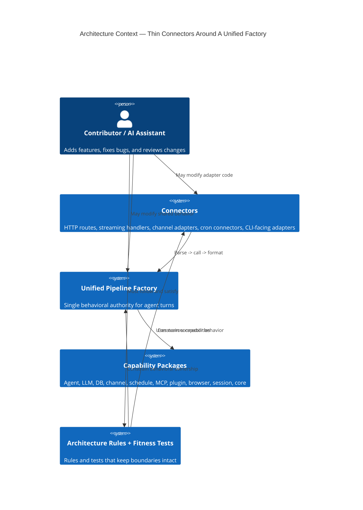

## 2. C4 Level 2: Container Diagram

This is the primary architecture diagram for the ruleset. It shows where
behavior lives and where it MUST NOT live.

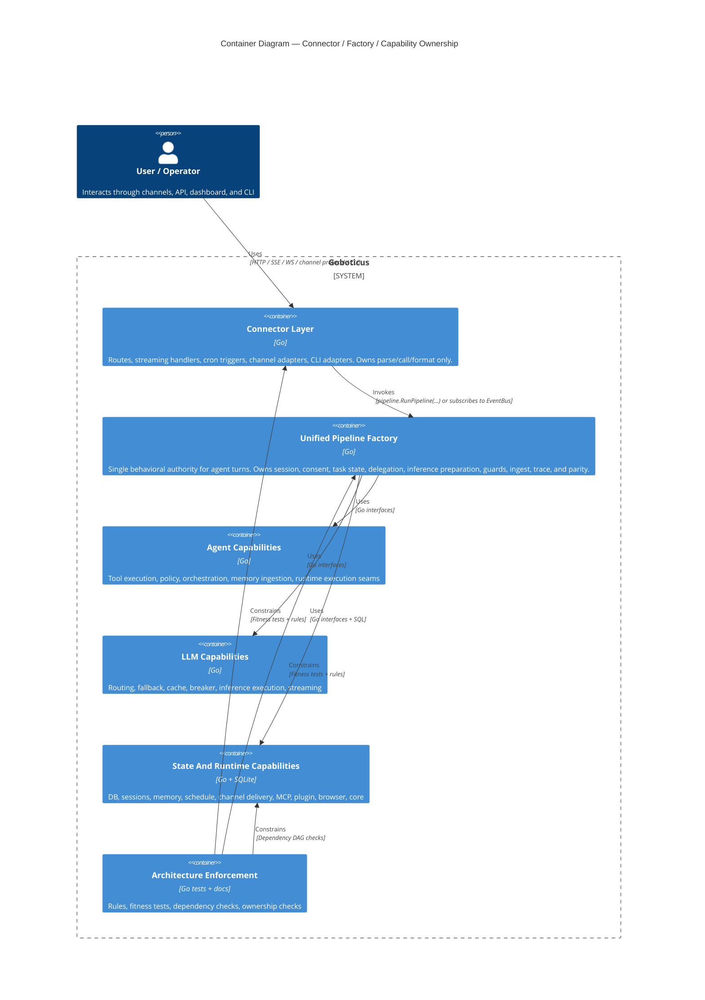

## 3. C4 Level 3: Component Diagram — Connector Layer

This is the clearest visual statement of the thin-connector rule.

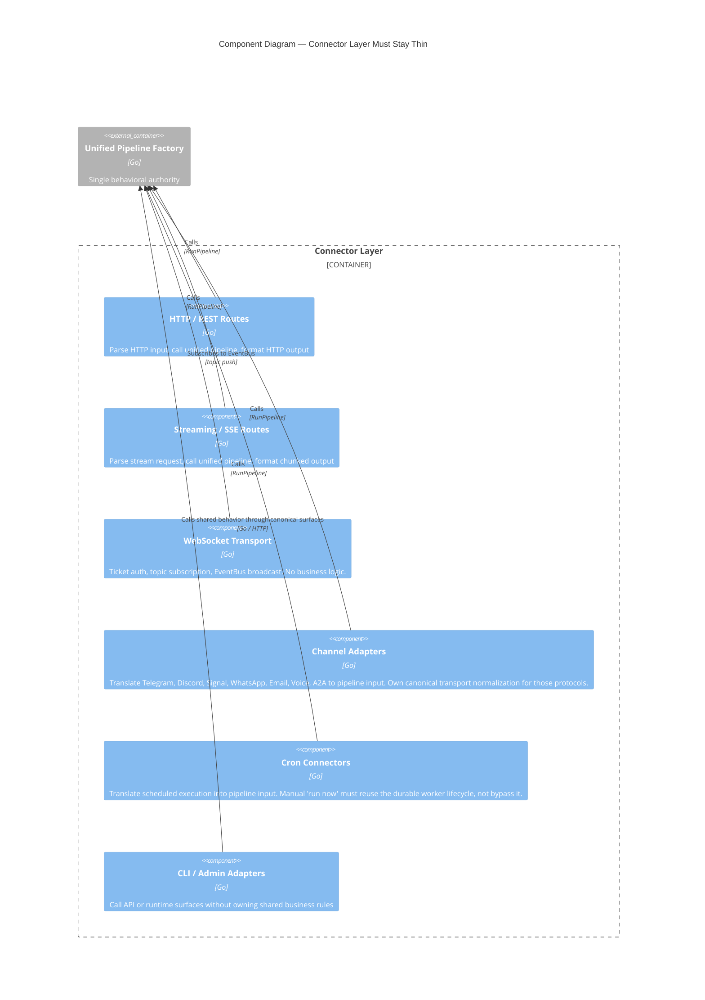

## 4. C4 Level 3: Component Diagram — Unified Pipeline Factory

This diagram shows what the architecture rules mean by "the pipeline owns
behavior."

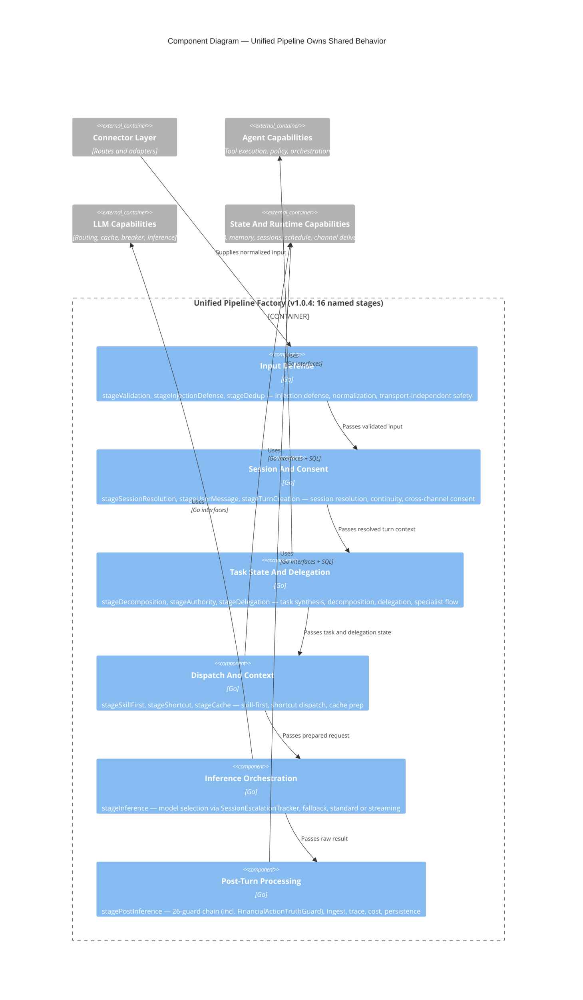

## 5. C4 Level 3: Component Diagram — Capability Narrowing

This diagram captures the intended replacement for broad service bags.

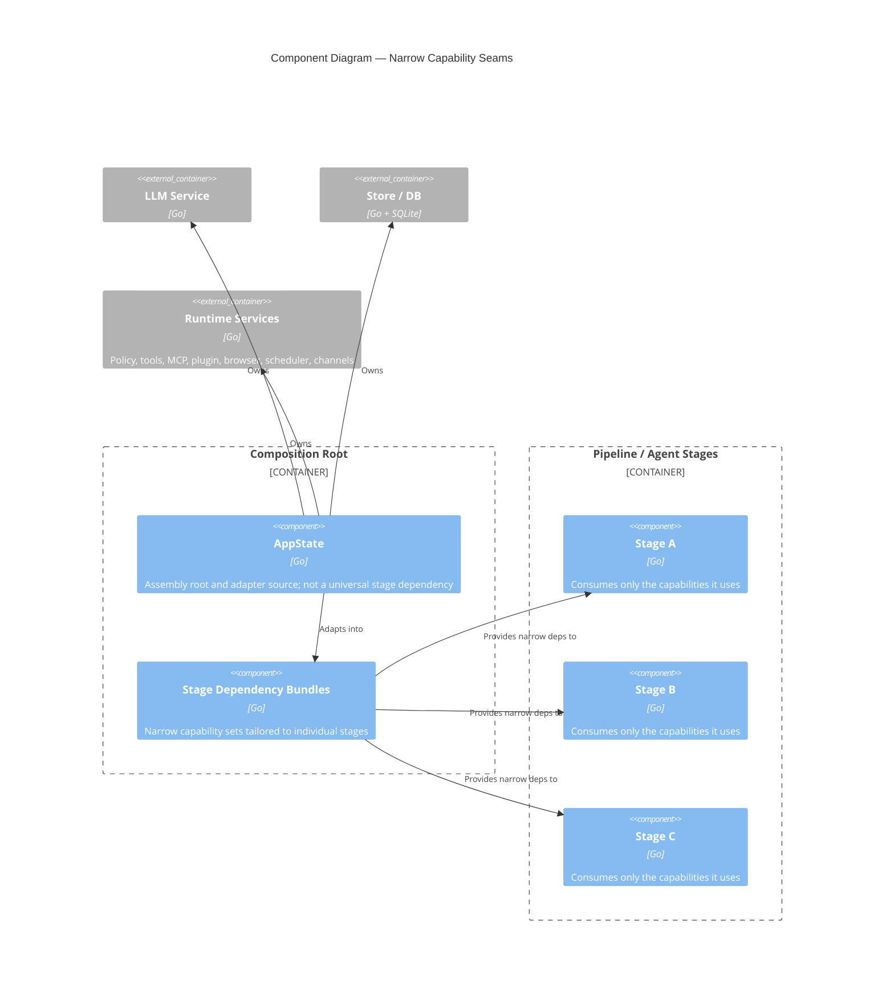

## 6. Supplementary Rule View — Operational Inventory Tools

Delegation-critical inventory such as subagent roster and skill availability
must be available on the live runtime tool surface. They are not allowed to
exist only as admin routes, dashboard summaries, or prompt-side snapshots.

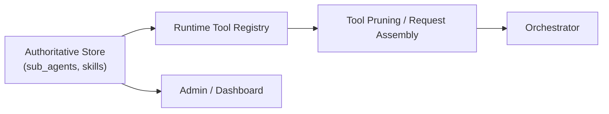

## 6.5 Supplementary Rule View — Capability Truth Ownership

Capability truth must be singular. The system is not allowed to show an
enabled skill in the UI, miss it in capability fit, omit it from the live
runtime matcher, and still tell the model it might exist. One authoritative
inventory must drive every downstream seam, and any config-gated capability
must degrade visibly and consistently when its runtime precondition is absent.

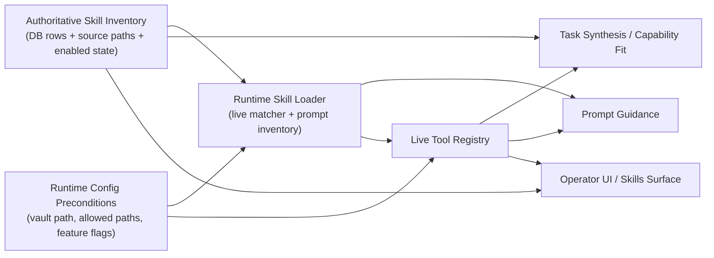

## 7. Supplementary Rule View — Delegation And Orchestration Ownership

Delegation is not allowed to devolve into a prompt-only trick. The orchestrator
may ask the runtime to orchestrate subagents, but the orchestration contract
must write the same durable lifecycle artifacts the runtime already exposes for
task inspection and retry. Subagent work still returns upward to the
orchestrator; the orchestration surface never reports directly to the operator.

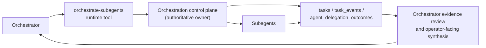

## 8. Supplementary Rule View — Security Claim And Sandbox Ownership

This view captures a runtime seam that was easy to misunderstand during parity
work: claim resolution is pipeline-owned, while sandbox enforcement is shared
across policy evaluation and tool/runtime path resolution. The important rule
is that those seams must agree on the operator-visible contract. Post-inference
guards are not allowed to invent a softer or harsher denial surface than the
actual tool/policy result; they may suppress fabricated capability claims, but
they must preserve real policy/sandbox denials as truth.

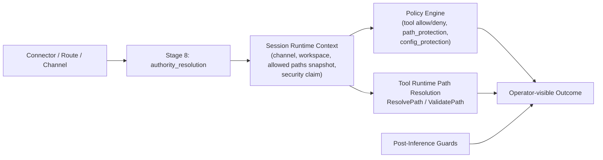

## 7. Supplementary Rule View — Release Control Plane

This view captures the release-distribution seam that `v1.0.6` exposed. The
operator-facing release is not the git tag by itself; it is the full published
control plane from tag through public site.

Two source-tree artifacts are part of that control plane before publication:

- `docs/releases/vX.Y.Z-release-notes.md`
- `CHANGELOG.md` section `## [X.Y.Z]`

If either is missing for the tagged version, the release is malformed and the
publication path must stop before claiming a live operator-facing release.

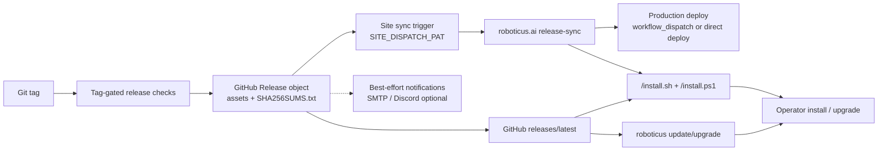

## 8. Supplementary Rule View — Streaming Is Not A Separate Product

This is a supporting diagram rather than a C4 view because it expresses a
behavioral equivalence rule.

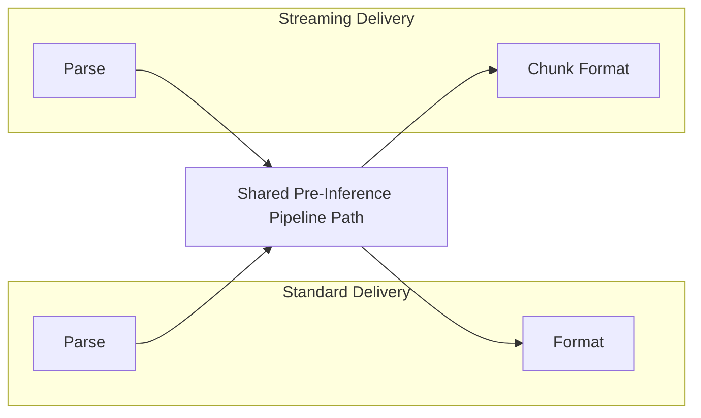

## 9. Supplementary Rule View — Host Resource Snapshot Ownership

Host resource state is not allowed to live as an ad hoc side metric or a
manual operator guess. Benchmark validity and turn RCA both depend on one
shared resource-sampling seam that feeds durable benchmark artifacts and the
canonical turn diagnostics artifact.

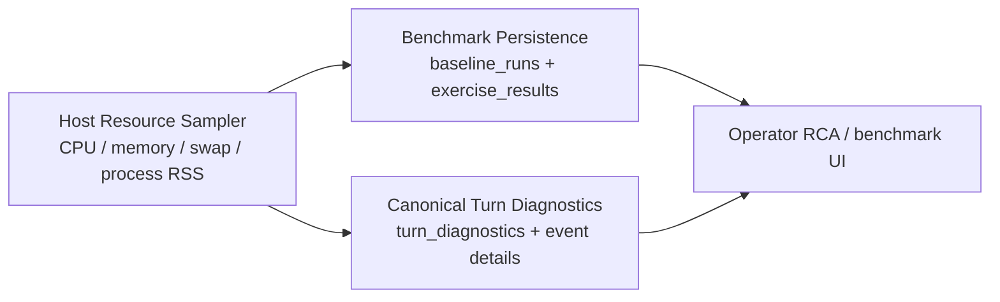

## 10. Supplementary Rule View — MCP SSE Validation Ownership

This view captures the rule behind `PAR-008`: SSE readiness claims must come
from one central validation harness and evidence artifact, not from scattered
fixture tests, checklist prose, or connector folklore. The same rule requires
one shared config-to-runtime conversion seam so auth/header semantics cannot
drift between daemon startup, route tests, and validation tooling.

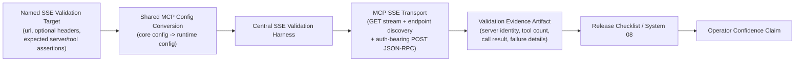

## 11. Supplementary Rule View — Channel Ingress Ownership

Webhook-capable channels follow the same thin-connector rule more strictly than
before: the route owns HTTP framing and pipeline dispatch, while the adapter
owns transport verification and payload normalization. Routes must not carry a
second copy of Telegram / WhatsApp webhook JSON parsing once the adapter
defines the canonical ingress contract.

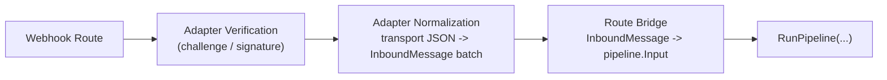

## 11.5 Supplementary Rule View — Extension Runtime Ownership

Plugin administration and plugin runtime are not the same thing. Install/search
surfaces may write plugin files or inspect catalogs, but the live runtime must
own registry construction, directory discovery, manifest parsing, init, and
install-time hot loading. Routes consume that runtime-owned registry; they do
not create their own view of plugin state. Manifest-backed plugin scripts and
skill scripts also share one core execution contract for containment,
interpreter allowlists, output limits, and sandbox env shaping.

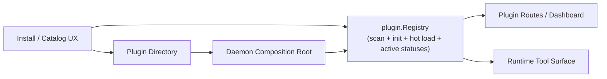

## 11. Supplementary Rule View — Request Construction Ownership

This view captures the validated v1.0.6 ownership rule for the inference
artifact. Tool selection, memory preparation, checkpoint restore, and prompt
assembly all converge into one `llm.Request`. The builder may compact or
compress older conversational history, but it must preserve the latest user
message and the higher-value system/memory surfaces.


## 10. Supplementary Rule View — Continuity And Learning Ownership

This view captures the validated v1.0.6 continuity rule. Post-turn artifacts
must be written from turn-owned evidence first, then promoted through explicit
consolidation seams. Reflection is not allowed to invent durable state from
weak proxies when structured turn artifacts already exist.

## 11. Supplementary Rule View — Model Policy And Routing Ownership

This view captures the v1.0.7 routing rule: policy filters come before ranking.
Model lifecycle state and role eligibility are architecture controls, not
tuning hints. Policy is resolved centrally from configured defaults plus
persisted operator overrides before any live or benchmark path can proceed.

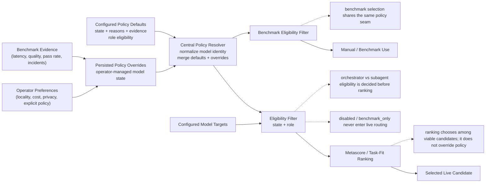

## 12. Supplementary Rule View — Orchestrator / Subagent Control Hierarchy

This view captures the v1.0.7 control-flow rule: operators never talk directly
to subagents, and subagents never report directly to operators.

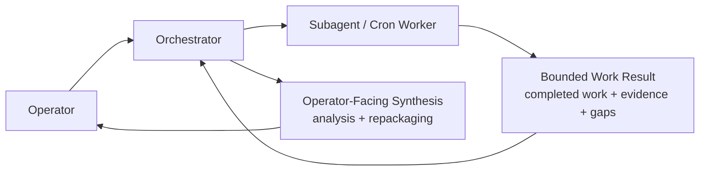

## 13. Supplementary Rule View — Delegated Task Lifecycle Ownership

This view captures the v1.0.7 rule for delegated work: task lifecycle state is
owned by one runtime repository and surfaced through orchestrator-facing tools,
not reconstructed from connector routes or subagent status sidecars.

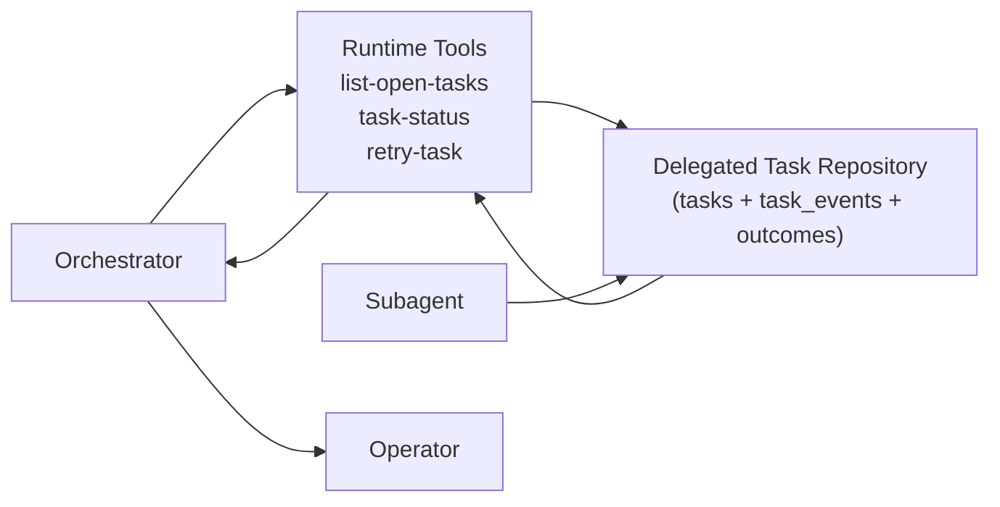

## 14. Supplementary Rule View — Subagent Composition Ownership

This view captures the v1.0.7 rule for worker creation: subagent composition is
owned by one runtime repository and may be invoked only by the orchestrator.

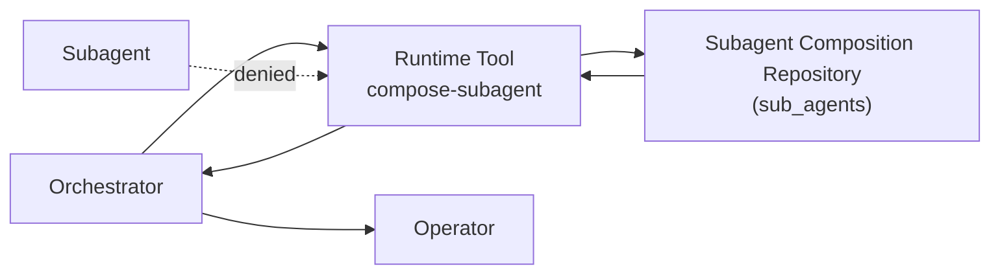

## 15. Supplementary Rule View — Skill Composition Ownership

This view captures the v1.0.7 rule for skill creation and update: skill
composition is owned by one runtime repository that writes both the durable
skill artifact and the authoritative `skills` row, and only the orchestrator
may invoke it directly.

```mermaid
flowchart LR
    orchestrator["Orchestrator"]
    compose["Runtime Tool\ncompose-skill"]
    repo["Skill Composition Repository\n(filesystem artifact + skills row)"]
    route["Catalog / Admin Install Route"]
    subagent["Subagent"]
    operator["Operator"]

    orchestrator --> compose --> repo
    route --> repo
    subagent -. denied .-> compose
    repo --> compose --> orchestrator --> operator
```

## 13. Supplementary Rule View — Observability Route Ownership

This view captures the final v1.0.6 route-family contract for trace surfaces.

```mermaid
flowchart LR
    summary["/api/traces\nsummary/search/detail list family"]
    observability["/api/observability/traces\nobservability page / waterfall family"]
    ws["WebSocket topic snapshots"]
    handlers["Canonical HTTP handlers"]
    release["Release notes / architecture docs"]

    summary --> handlers
    observability --> handlers
    ws --> handlers
    release --> handlers
```

## 14. Supplementary Rule View — Operator RCA Flow Ownership

The operator-facing flow view is not allowed to degrade into a thin wrapper
around raw trace rows. The canonical `turn_diagnostics` artifact is the
authoritative RCA surface, and the UI must present it as a decision narrative:

- macro by default
- detailed only on explicit operator demand
- grouped by decision seam instead of raw event order
- desktop-first left-to-right comprehension rather than a disguised vertical log
- persisted summary narratives must already be interpretive conclusions derived
  from the turn facts, not placeholders that merely say diagnostics exist

```mermaid
flowchart LR
    diag["Canonical turn_diagnostics\nsummary + events + recommendations"]
    flow["/api/traces/{turn}/flow\nstage timing / structural flow"]
    ui["Operator Flow View\nmacro RCA narrative + detailed drilldown"]
    macro["Macro View\nTask · Envelope · Routing · Execution · Recovery · Outcome"]
    detail["Detailed View\ncategorized event stream + raw evidence"]
    operator["Operator"]

    diag --> ui
    flow --> ui
    ui --> macro
    ui --> detail
    macro --> operator
    detail --> operator
```

## 15. Supplementary Rule View — Verifier Evidence Ownership

This view captures the active v1.0.7 verifier-depth rule: contradiction and
proof evaluation must consume the same typed evidence artifact produced by
retrieval/context assembly. The verifier is not allowed to reconstruct that
state later from lossy rendered text or a boolean-only contradiction flag.

```mermaid
flowchart LR
    retrieval["Stage 8.5 Retrieval / Context Assembly"]
    typed["Typed Verification Evidence\nEvidenceItems\nContradictions\nExecutive State"]
    session["Session Artifact Boundary"]
    verifier["Verifier / Claim Audits"]
    issues["Verification Issues\nmissing proof / contradiction handling"]
    trace["Turn Diagnostics / Trace"]

    retrieval --> typed --> session --> verifier
    verifier --> issues
    verifier --> trace

    note1["Contradictions are structured artifacts,\nnot only a boolean summary"]
    note2["Proof obligations are evaluated per claim"]
    note3["RCA and future ML use the same verifier artifact"]

    typed -.-> note1
    verifier -.-> note2
    trace -.-> note3
```

## 16. Supplementary Rule View — Retrieval Fusion Ownership

Fusion is now an explicit retrieval-stage concern, not a side effect spread
across router weights and reranker adjustments. The rule is:

- tier retrieval produces raw candidates with provenance
- fusion combines route weight, provenance, freshness, authority, and
  corroboration into the first unified retrieval-quality score
- optional LLM reranking may run after fusion as a bounded semantic scorer
- deterministic reranking still owns the final narrowing / collapse protection
  and remains the fallback path when LLM reranking does not run cleanly

```mermaid
flowchart LR
    decompose["Query Decomposition"]
    route["Retrieval Router"]
    tiers["Tier Retrieval\nsemantic / episodic / procedural / relationship"]
    fusion["Fusion Stage\nroute weight + provenance + freshness + authority + corroboration"]
    llmrerank["Optional LLM Rerank\nbounded semantic scoring"]
    rerank["Deterministic Reranker\nthresholding / narrowing / collapse protection"]
    assemble["Context Assembly"]
    trace["RCA / ML Surfaces"]

    decompose --> route --> tiers --> fusion --> llmrerank --> rerank --> assemble
    fusion --> trace
    llmrerank --> trace
    rerank --> trace
```

```mermaid
flowchart LR
    inference["Inference Turn"]
    traces["Turn Artifacts\ntool_calls\npipeline_traces\nmodel_selection_events"]
    post["Post-Turn Pipeline\nreflection + executive growth + checkpoint policy"]
    episodic["episodic_memory\ncontent + content_json"]
    executive["Executive / Working State"]
    checkpoint["CheckpointRepository\nsave / load / prune"]
    consolidate["Consolidation / Distillation"]
    semantic["semantic_memory"]
    facts["knowledge_facts"]

    inference --> traces --> post
    post --> episodic
    post --> executive
    post --> checkpoint
    episodic --> consolidate
    consolidate --> semantic
    consolidate --> facts

    note["Structured artifacts are authoritative;\ncompact text summaries are for human readability, not downstream reparsing"]
    episodic -.-> note
```

## 11. Supplementary View — WebSocket Topic Subscription (v1.0.3+)

The WebSocket layer is a push-only delivery connector. It does not call
`RunPipeline()` — it subscribes to the EventBus that the pipeline publishes to.

```mermaid
sequenceDiagram
    participant D as Dashboard (Browser)
    participant WS as WS Transport
    participant EB as EventBus
    participant P as Pipeline
    participant DB as SQLite

    D->>WS: Upgrade + ticket
    WS->>WS: Validate ticket (anti-CSRF)
    D->>WS: subscribe(topics=["sessions","traces"])

    Note over P: User message arrives via HTTP/channel
    P->>DB: Persist session, trace, etc.
    P->>EB: Publish(topic="sessions", payload)
    P->>EB: Publish(topic="traces", payload)

    EB->>WS: Deliver "sessions" event
    EB->>WS: Deliver "traces" event
    WS->>D: Push session update
    WS->>D: Push trace update
```

## 12. Supplementary Rule View — No Symptom Fixes

This is a supporting debugging diagram rather than a structural one.

```mermaid
flowchart TD
    bug["Behavior Diverges Across Surfaces"]
    working["Trace Working Path"]
    broken["Trace Broken Path"]
    diff["Identify Shared Divergence"]
    shared["Fix Shared Pipeline / Shared Capability"]
    verify["Verify All Surfaces Inherit The Fix"]

    wrong1["Patch Broken Connector"]
    wrong2["Remove Feature From Working Path"]
    wrong3["Copy Logic Across Connectors"]

    bug --> working
    bug --> broken
    working --> diff
    broken --> diff
    diff --> shared --> verify

    diff -. "MUST NOT" .-> wrong1
    diff -. "MUST NOT" .-> wrong2
    diff -. "MUST NOT" .-> wrong3
```

## 13. Supplementary Rule View — Enforcement Model

This diagram shows how the architecture is kept real.

```mermaid
flowchart LR
    rules["Rules Docs"]
    tests["Fitness + Behavioral Tests"]
    review["Review Checklist"]
    code["Repository Code"]

    rules --> tests
    rules --> review
    tests --> code
    review --> code
```

## 14. Reading Guide

- Use the C4 context and container views to understand architectural ownership.
- Use the connector-layer component diagram when reviewing route, streaming,
  cron, channel, or CLI changes.
- Use the pipeline component diagram when deciding whether behavior belongs in
  the factory.
- Exercise/baseline prompt selection belongs to the shared exercise factory:
  connectors may choose models, iterations, and an optional canonical intent
  filter, but they must not define ad hoc prompt subsets or capability slices
  outside the matrix owned by `internal/llm`.
- Use the capability diagram when evaluating stage dependencies and service-bag
  creep.
- Use the supporting diagrams when validating streaming parity, debugging
  divergence, checking request-artifact ownership, continuity/learning
  ownership, or explaining why a local connector patch is incorrect.

If a proposed code change does not fit cleanly onto these diagrams, the change
SHOULD be treated as architecturally suspect until its ownership becomes clear.

## 14. Memory Retrieval Architecture (v1.0.1+)

Two-stage pattern: direct injection for cheap/session-scoped data, index for
everything else. The model uses tools (`recall_memory`, `search_memories`) to
fetch full content on demand.

```mermaid
sequenceDiagram
    participant U as User Message
    participant P as Pipeline
    participant R as Retriever
    participant DB as SQLite
    participant CB as ContextBuilder
    participant M as Model (LLM)
    participant T as search_memories / recall_memory

    U->>P: "Do you remember palm?"
    P->>R: RetrieveDirectOnly(session, query, budget)
    R->>DB: SELECT from working_memory (session-scoped)
    R->>DB: SELECT from episodic_memory (last 2 hours)
    R-->>CB: [Working Memory] + [Recent Activity]

    P->>DB: BuildMemoryIndex(store, 20, "palm")
    Note over DB: Strategy 1: LIKE on memory_index.summary WHERE '%palm%'
    Note over DB: Strategy 2: FTS5 MATCH on memory_fts JOIN memory_index
    Note over DB: Fill remaining with tier-priority top-N
    DB-->>CB: [Memory Index] with Palm entries in first 1/3

    CB->>M: System prompt + Working + Ambient + Index + History
    M->>T: search_memories(query="palm")
    T->>DB: FTS5 MATCH + LIKE fallback (all tiers)
    DB-->>T: 21 results
    T-->>M: Matching memories with source IDs
    M->>T: recall_memory(id="idx-obsidian-Projects/Pal")
    T->>DB: SELECT full content from source tier
    DB-->>T: Full Palm USD project details
    T-->>M: Complete memory content
    M-->>U: Response with real Palm memories
```

### What Gets Injected vs. What Requires Tool Calls

| Layer | Injection | Source |
|-------|-----------|--------|
| Working Memory | **Direct** (always) | `working_memory` table, session-scoped |
| Recent Activity | **Direct** (always) | `episodic_memory` last 2 hours |
| Memory Index | **Direct** (query-aware) | `memory_index` top-20 + FTS matches |
| Episodic details | **Tool** (`recall_memory`) | `episodic_memory` by ID |
| Semantic facts | **Tool** (`recall_memory`) | `semantic_memory` by ID |
| Procedural stats | **Tool** (`recall_memory`) | `procedural_memory` by ID |
| Relationship data | **Tool** (`recall_memory`) | `relationship_memory` by ID |
| Topic search | **Tool** (`search_memories`) | FTS5 + LIKE across all tiers |

---

## 15. Agentic Retrieval Architecture (v1.0.5)

```
User Query
    │
    ▼
┌────────────────────┐
│ Intent Classifier   │ ← 9 categories (centroid-based)
└────────┬───────────┘
         │
         ▼
┌────────────────────┐
│ Query Decomposer   │ ← splits compound queries into subgoals
└────────┬───────────┘
         │
         ▼
┌────────────────────┐
│ Retrieval Router   │ ← selects tiers + modes per subgoal
│ (11 routing plans) │
└────────┬───────────┘
         │
    ┌────┴────────────────┐
    │  Per-Tier Retrieval  │
    │ ┌─────┐ ┌─────┐     │
    │ │Epis.│ │Sem. │ ... │ ← BM25 + vector hybrid per tier
    │ └──┬──┘ └──┬──┘     │
    └────┼───────┼────────┘
         │       │
         ▼       ▼
┌────────────────────┐
│ Reranker / Filter  │ ← discard weak, boost authority, detect collapse
└────────┬───────────┘
         │
         ▼
┌────────────────────────────────────────┐
│ Context Assembly                       │
│ [Working State] ← direct injection     │
│ [Evidence]      ← ranked with scores   │
│ [Gaps]          ← missing tiers        │
│ [Contradictions]← conflicting entries  │
└────────┬───────────────────────────────┘
         │
         ▼
    LLM Reasoning Engine
         │
         ▼
    Post-Turn:
    ├── Reflection (episode summary → episodic_memory)
    ├── Procedure Detection (tool sequences → learned_skills)
    └── Consolidation (dreaming: promote, decay, prune)
```

### Memory Type Roles

| Memory | Question Answered | Retrieval Method | Searched? |
|--------|-------------------|-----------------|-----------|
| Semantic | "What is true?" | BM25 + vector hybrid | Yes (via router) |
| Episodic | "What happened before?" | FTS + recency union | Yes (via router) |
| Procedural | "How do I do this?" | Keyword + learned skills | Yes (via router) |
| Relationship | "Who is involved?" | Keyword lookup | Yes (via router) |
| Working | "What am I doing now?" | N/A — direct injection | **No** — active state |
