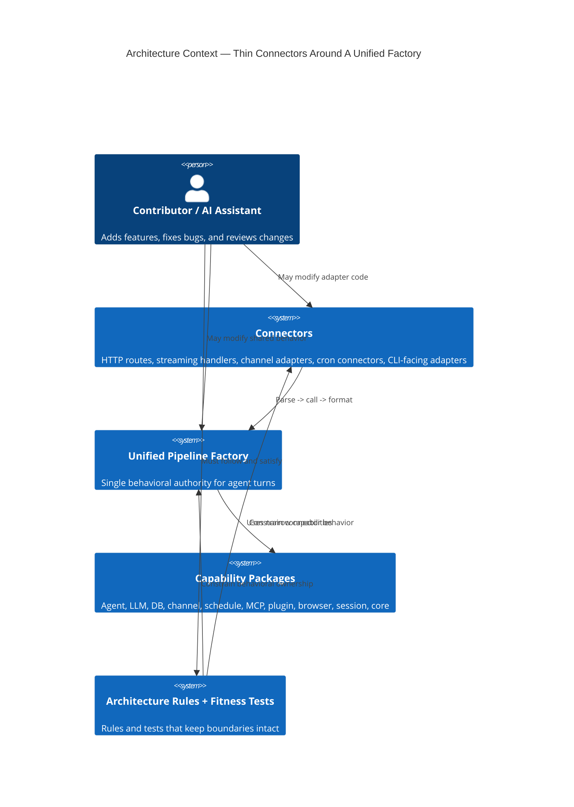
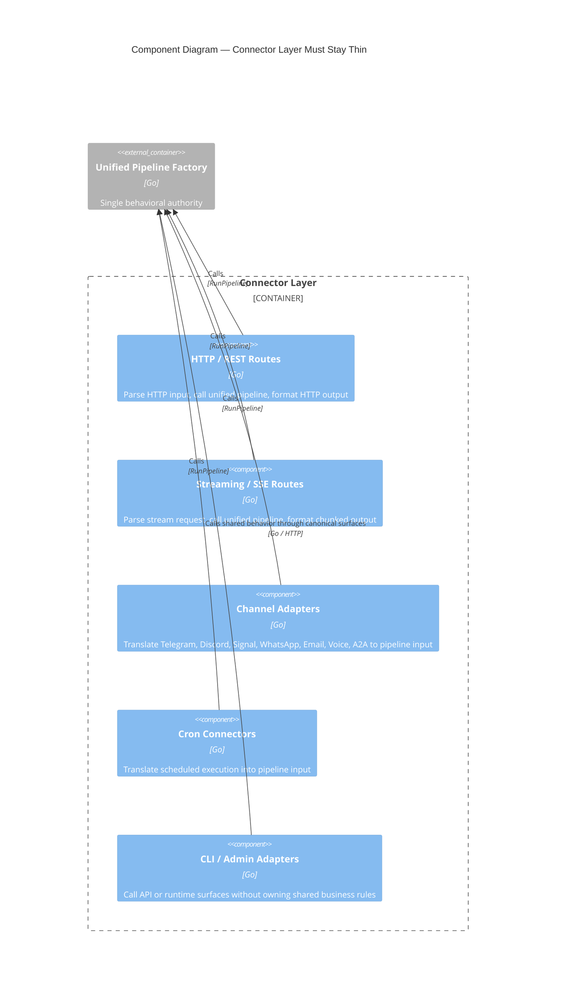
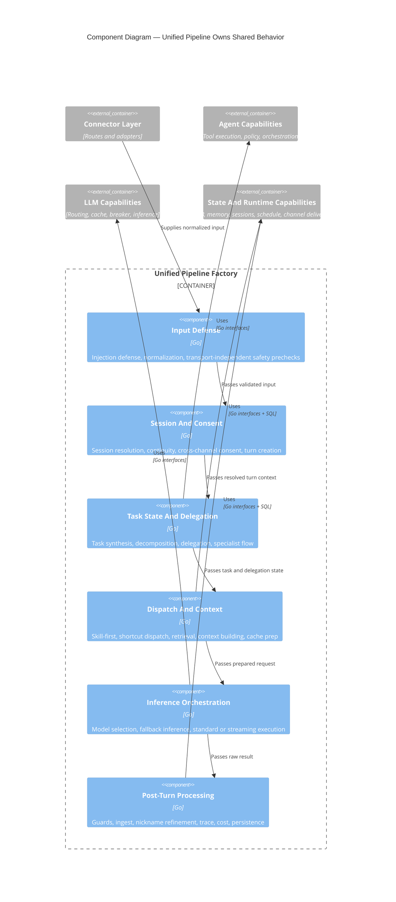
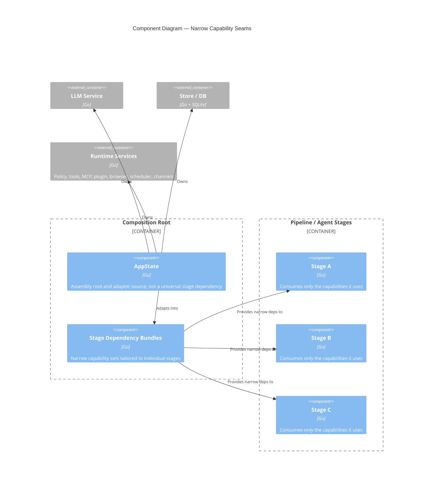
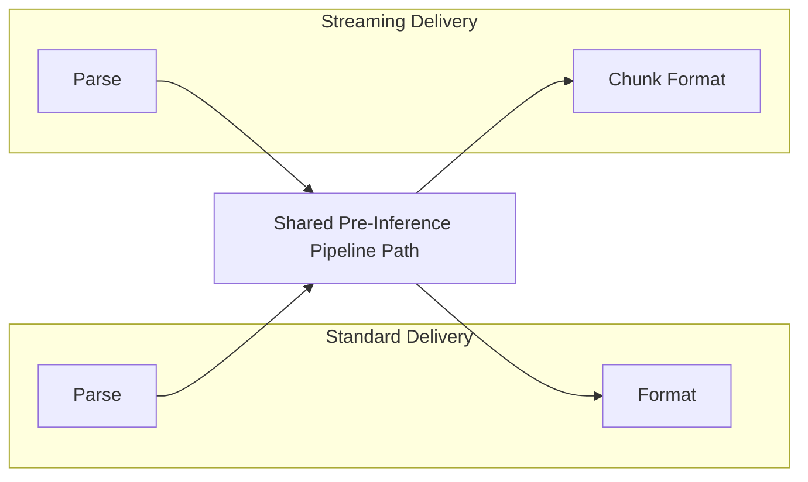
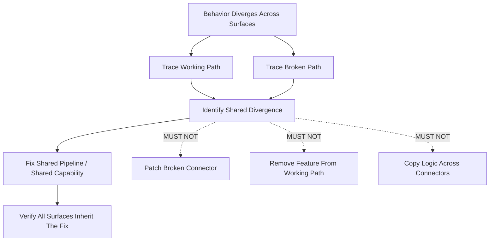
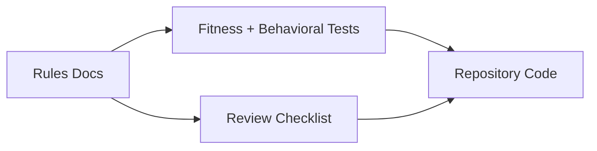

# Architecture Rules Diagrams

These diagrams are the visual companion to
[architecture_rules.md](/Users/jmachen/code/roboticus/architecture_rules.md)
and [ARCHITECTURE.md](/Users/jmachen/code/roboticus/ARCHITECTURE.md).

They are intentionally optimized for:

- thin-connector comprehension
- centralized pipeline ownership
- inward dependency direction
- narrow capability seams
- visual legibility over exhaustiveness

The preferred notation in this file is C4. Supporting diagrams are included
only where a dynamic or rule-oriented view is clearer than a structural one.

## C4 Conventions

This file follows the same C4 conventions used elsewhere in the repo:

- one architectural level per diagram
- explicit relationship labels
- transport adapters shown as adapters, not as owners of behavior
- pipeline shown as the central factory
- supporting non-C4 diagrams clearly labeled as such

## 1. C4 Level 1: Architecture Context

This diagram explains the architecture in terms of ownership, not deployment.

## 2. C4 Level 2: Container Diagram

This is the primary architecture diagram for the ruleset. It shows where
behavior lives and where it MUST NOT live.

## 3. C4 Level 3: Component Diagram — Connector Layer

This is the clearest visual statement of the thin-connector rule.

## 4. C4 Level 3: Component Diagram — Unified Pipeline Factory

This diagram shows what the architecture rules mean by "the pipeline owns
behavior."

## 5. C4 Level 3: Component Diagram — Capability Narrowing

This diagram captures the intended replacement for broad service bags.

## 6. Supplementary Rule View — Streaming Is Not A Separate Product

This is a supporting diagram rather than a C4 view because it expresses a
behavioral equivalence rule.

## 7. Supplementary Rule View — No Symptom Fixes

This is a supporting debugging diagram rather than a structural one.

## 8. Supplementary Rule View — Enforcement Model

This diagram shows how the architecture is kept real.

## 9. Reading Guide

- Use the C4 context and container views to understand architectural ownership.
- Use the connector-layer component diagram when reviewing route, streaming,
  cron, channel, or CLI changes.
- Use the pipeline component diagram when deciding whether behavior belongs in
  the factory.
- Use the capability diagram when evaluating stage dependencies and service-bag
  creep.
- Use the supporting diagrams when validating streaming parity, debugging
  divergence, or explaining why a local connector patch is incorrect.

If a proposed code change does not fit cleanly onto these diagrams, the change
SHOULD be treated as architecturally suspect until its ownership becomes clear.
